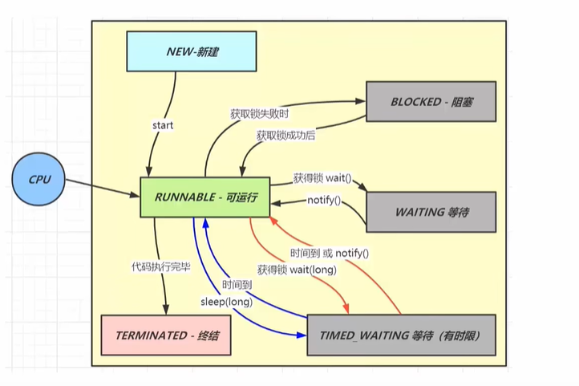

# JAVA 线程状态
 java共有6种线程状态

参考图片：


## 一、 RUNNABLE(可运行)
 - Java种的RUNNABLE涵盖了操作系统线程状态的 就绪、运行、阻塞I/O

## 二、NEW（新建）
 - Thread thread = new Thread 线程创建完毕后，没有执行start方法之前都是NEW

## 三、BLOCKED(阻塞)
 - 获取到锁失败，进行BLOCKED，还没有获取到锁
 - BLOCKED阻塞状态，如果获取到了锁，则就会进入可运行状态

## 四、WAITING (等待)
 - 

## 五、TIME_WAITING(有时限等待)


## 六、TERMINATED(终结)
- 代码执行结束
 
锁状态的简单状态转换
```text
                synchronized(lock)
                      │
                      ▼
             ┌─────────────────┐
             │ 抢到锁了吗？      │
             └─────────────────┘
                 │        │
              没抢到      抢到了
                 │        │
                 ▼        ▼
             BLOCKED   Runnable
                           │
                    执行代码...
                           │
                     lock.wait()
                           │
                           ▼
                      WAITING
                           │
                notify()/notifyAll()
                           │
                           ▼
                   再去竞争锁
                           │
                     抢不到→BLOCKED
                     抢到→Runnable


```