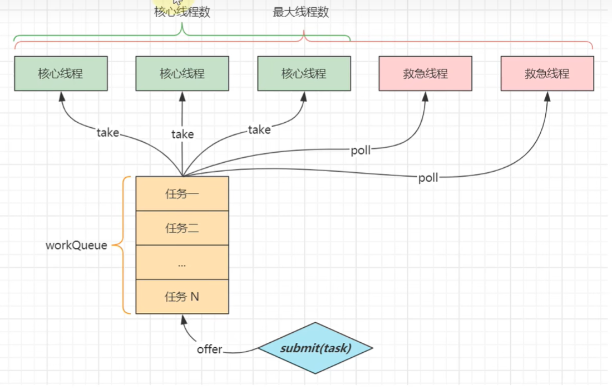

# 线程池的核心参数
 - 线程池的7个核心参数


## 1. corePoolSize 核心线程数目
   
## 2. maximumPoolSize 最大线程数 （核心线程数+紧急线程数）

## 3. keepAliveTime 生存时间（针对紧急线程）

## 4.unit 时间单位（针对紧急线程）

## 5.workQueue （阻塞队列）
- 若核心线程都在工作，则任务先回入阻塞队列。若阻塞队列也满了，就会进行紧急线程的创建。
- ArrayBlockingQueue  数组  固定容量，最常用
- LinkedBlockingQueue 链表 默认无界（也可有界），需指定容量。
- SynchronousQueue
- PriorityBlockingQueue
- DelayQueue


## 6.threadFactory(线程工厂)

## 7.handler 拒绝策略
 - AbortPolicy： 直接报异常
 - CallerRunsPolicy：调用者线程执行
 - DiscardPolicy：直接丢弃任务
 - DiscardOldestPolicy：丢弃队列中最老的任务
 - 实际生产环境：我们往往不用JDK自带的4种拒绝策略。我们往往自定义拒绝策略，然后结合MQ进行重试，保证任务最终执行。因此生产环境不能无限立即重试，而应该采用有限次数重试、指数退避或延迟队列。核心业务还要保证幂等

## 完整的线程池执行的流程
```text
                 提交任务
                     │
                     ▼
         核心线程没满？──────是────► 创建核心线程执行
              │
              否
              ▼
        队列没满？──────────是────► 放入阻塞队列
              │
              否
              ▼
      最大线程没满？──────是────► 创建非核心线程执行
              │
              否
              ▼
          拒绝策略

──────────────────────────────────

任何线程执行完当前任务后：

          Core-1
          Core-2
          Worker-3
          Worker-4
                │
                ▼
      都会调用 getTask()
                │
                ▼
      从同一个阻塞队列取下一个任务
                │
                ▼
          谁空闲谁先拿到任务 

唯一差别：
Core：一直等待，不退出（默认）
Worker：空闲超过 keepAliveTime 后退出

```

- 注意：核心线程和紧急线程取任务，都是从队列拿，逻辑是一致的。
- 其次若阻塞队列满了，新任务进来了，创建紧急线程任务时，任务会先于阻塞队列执行是有可能的。


