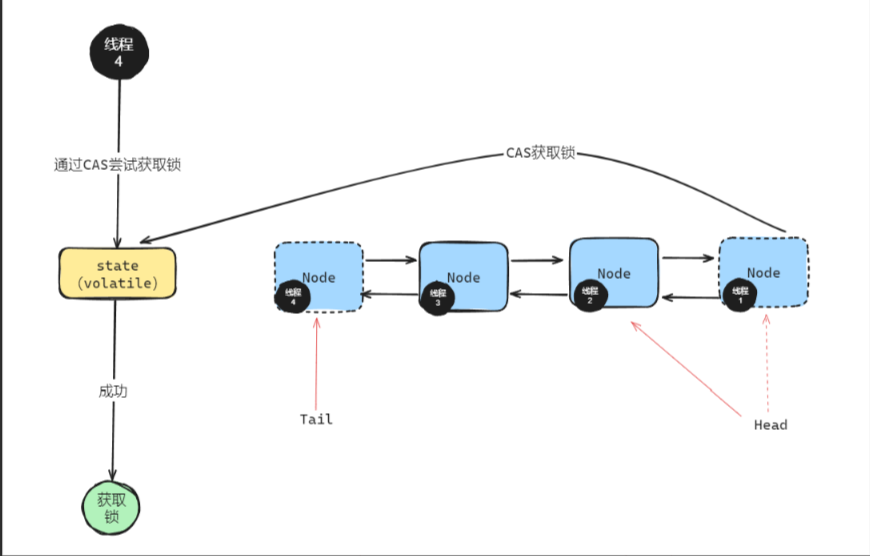
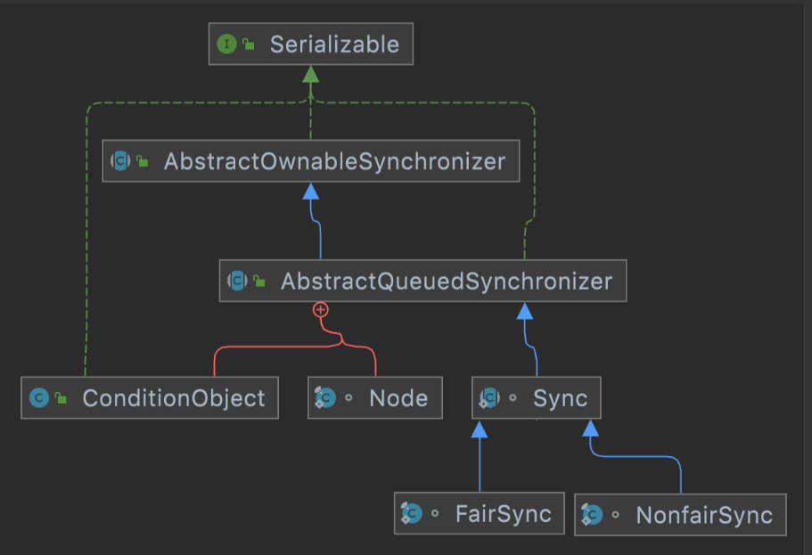
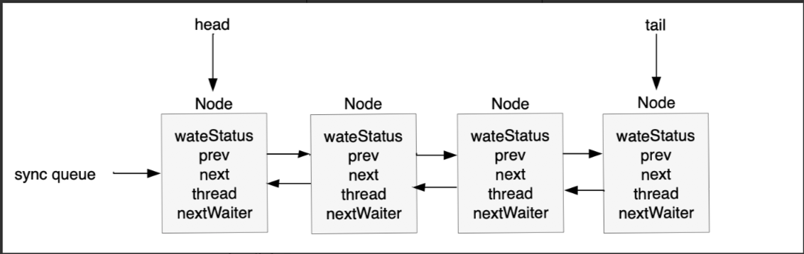

# AQS

## 1. 基本概念
  AbstractQueuedSynchronizer(抽象队列同步器，AQS)，是很多同步器的基础框架，比如ReentrantLock、CountDownLatch、Semaphore。
  
## 2. 类定义
```java
public abstract class AbstractQueuedSynchronizer
    extends AbstractOwnableSynchronizer
    implements java.io.Serializable {
}
```

在AQS内部，维护了FIFO队列和一个volatile修饰的state变量，state=1表示当前对象锁已经被占用了，state的值修改通过CAS去完成的。



注意：CAS和 volatile 在AQS中是互补的：CAS提供原子性操作以避免锁的使用，而 volatile 确保修改的可见性和内存操作的有序性。两者结合，使得AQS能够以一种高效且线程安全的方式管理同步状态。


## 3. state 同步状态
 AQS使用一个volatile int 类型的成员变量来同步状态，state=1表示对象锁已经被占有，提供3个基本的对state的操作同步方法。

```java
// 同步状态
private volatile int state;

// 获取状态
protected final int getState() {
    return state;
}

// 设置状态
protected final void setState(int newState) {
    state = newState;
}

// CAS更新状态
protected final boolean compareAndSetState(int expect, int update) {
    // See below for intrinsics setup to support this
    return unsafe.compareAndSwapInt(this, stateOffset, expect, update);
}

```

## 4. FIFO队列 -Node

- 当线程尝试获取资源失败时，AQS会将该线程包装成一个Node节点，并将其插入同步队列的尾部，在资源可用时，队列头部的节点尝试获取资源。

- Node节点的类结构
```java
// Node类用于构建队列
static final class Node {
    // 标记节点状态。常见状态有 CANCELLED（表示线程取消）、SIGNAL（表示后继节点需要运行）、CONDITION（表示节点在条件队列中）等。
    volatile int waitStatus;
    // 前驱节点
    volatile Node prev;
    // 后继节点
    volatile Node next;
    // 节点中的线程，存储线程引用，指向当前节点所代表的线程。
    volatile Thread thread;
}

// 队列头节点，延迟初始化。只在setHead时修改
private transient volatile Node head;
// 队列尾节点，延迟初始化。
private transient volatile Node tail;

// 入队操作
private Node enq(final Node node) {
    for (;;) {
        Node t = tail;
        if (t == null) { // 必须先初始化
            if (compareAndSetHead(new Node()))
                tail = head;
        } else {
            node.prev = t;
            if (compareAndSetTail(t, node)) {
                t.next = node;
                return t;
            }
        }
    }
}

```

FIFO队列如下：


AQS中的阻塞队列是一个CLH队列

CLH
 - 概念： 本来是一种公平锁算法，不是所有线程一起抢所，而是每一个人只盯自己前面的那个人，前面那个是不是已经释放锁了？
 - 问题：若是所有线程一起抢占所，则一直自旋，一直在CAS，CPU会打爆。
 - 解决方法：AQS 采用的是短暂自旋 + 阻塞等待的混合策略
 


##  5. AQS的锁机制

- 排它锁：多个线程竞争资源时，同一个时刻只有一个线程访问共享资源，比如ReentrantLock
- 共享锁：也称为读锁，同一个时刻允许多个线程同时获得锁资源，比如CountDownLatch、Semaphore


## 6. AQS的关键属性字段
1. private transient volatile Node head;
2. private transient volatile Node tail;


## 7. AQS的阻塞队列和线程池的2个常用的阻塞队列的区别

- 结构上：
   1. AQS是一个双向链表，通过head 和tail以及Node的pre和next链接。
   2. LinkedBlockingQueue：是一个Node结构，但是只有next的一个单向链表结构。
   3. ArrayBlockingQueue 是一个数组结构，属性成员，Object[] items 和putIndex  takeIndex的成员属性。

- Node的存储内容：
  1. AQS存储的是等待锁的线程节点Node
  2. LinkedBlockingQueue存放的是Runable的一个任务。

## 7.1 AQS的阻塞队列Node为什么需要pre的指向
 next是为了唤醒后继节点，而pre的作用是自己使用的。
 
  作用：
 - 1. 可以判断是否需要去获取锁，final Node p = node.predecessor();获取前面一个节点，如果不是head后面的第一个节点，就继续睡。否则就尝试获取锁。
 - 2. 若某一个线程节点超时取消了，需要从队列中移除，通过O(1),就可以完成，例如：
  ```text
       head
        ↓
        T2
        ↓
        T3
         ↓
        T4
    
    1. 此时T3取消，只需要T2.next= T4, T4.pre=T2结束。不需要从头开始找

   ```

