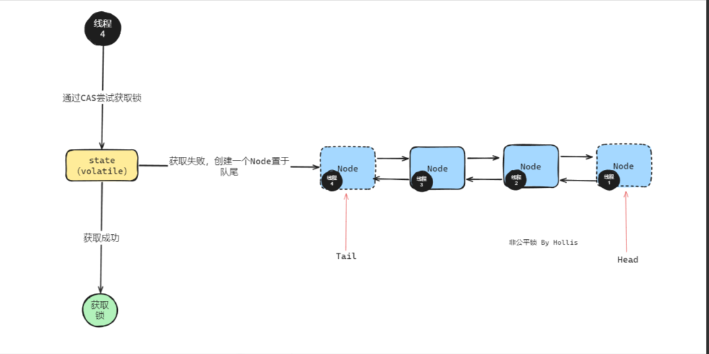

# 公平锁和非公平锁

- 非公平锁：不是按照线程的先进先出，而是首先尝试获取锁，若获取得到锁，直接拿到锁。结束，未拿到，则进入等待队列

  1. 特点：减少了线程唤醒的开销，吞吐量更高，但是可能会导致有的线程一直获取不到锁。
   
  2. ReenTrantLock的非公平锁实现
   ```java
  static final class NonfairSync extends Sync {
      private static final long serialVersionUID = 7316153563782823691L;
  
      final void lock() {
        if (compareAndSetState(0, 1))
          setExclusiveOwnerThread(Thread.currentThread());
        else
          acquire(1);
      }
  
     protected final boolean tryAcquire(int acquires) {
      return nonfairTryAcquire(acquires);
     }
  }

   ```
  先判断是否有锁，否没锁，直接CAS，成功直接获取锁,如果有线程尝试获取锁的时候，不会直接排队

>注意： "新来的线程可以插队"。如果没有新的线程参与竞争，也没有线程取消、中断等特殊情况，那么 AQS 队列中的线程实际上会按照 FIFO 顺序依次被唤醒并获取锁


- 公平锁：多个线程按照申请锁的顺序获取锁，所有线程都是按照队列排队获取锁的
 
  1. 特点： 所有线程都可以获得锁，但是吞吐量下降

  2. ReenTrantLock的非公平锁实现
  ```java
    
  static final class FairSync extends Sync {
     private static final long serialVersionUID = -3000897897090466540L;

   final void lock() {
       acquire(1);
    }
    
      protected final boolean tryAcquire(int acquires) {
         final Thread current = Thread.currentThread();
         int c = getState();
         if (c == 0) {
            if (!hasQueuedPredecessors() &&
                compareAndSetState(0, acquires)) {
                setExclusiveOwnerThread(current);
                return true;
           }
        }
        else if (current == getExclusiveOwnerThread()) {
            int nextc = c + acquires;
         if (nextc < 0)
             throw new Error("Maximum lock count exceeded");
             setState(nextc);
             return true;
         }
          return false;
      }
  } 
   ```
 公平锁在cas之前多了一个队列是否节点的判断，它会在AQS队列中没有线程的情况下才会申请锁
>注意：公平锁中，只要发现队列里已经有人等待（准确来说：自己前面已经有等待节点），新来的线程不会去 CAS 抢锁，而是直接进入队列尾部（tail）等待。 


