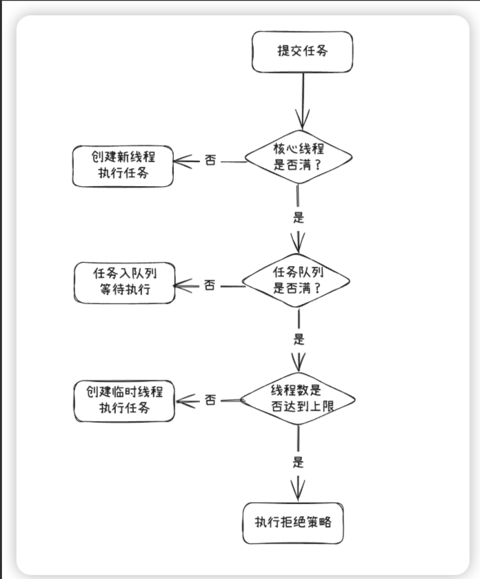
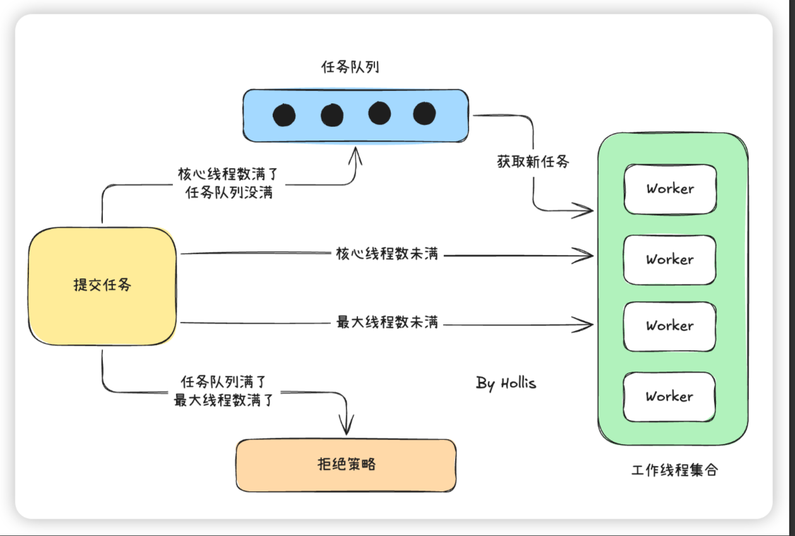

# JAVA并发知识

## 1. 什么是多线程中的上下文切换
>答：多线程下,CPU执行会上下切换线程，在CPU执行下一个线程时，会保存当前线程的运行状态信息，比如寄存器、栈信息。以便下次恢复执行时，然后恢复线程时，又要去读取以前的状态，造成系统的资源浪费。所以频繁的奇幻上下文，会降低系统的运行效率。

## 2.如何减少上下文切换
 - 合理的设置线程数，通过线程池管理
 - 对锁编程或者无锁编程，尽量避免线程切换。

## 3.线程安全的理解
  在多线程下，多个线程对数据的操作，可能并不可见，或者说同时修改的情况，结果并不是想要的。

## 4. 共享变量
 在JVM中，Java堆和方法区的区域是多个线程共享的数据区域，保存在堆和方法区的变量就是java的共享变量。所以共享变量可能存在线程安全问题。

## 5. 守护线程与普通线程
> Java中有2类线程，用户线程和守护线程，用户线程一般执行普通任务，守护线程一般执行后台，比如垃圾回收这种。如果JVM只剩下守护线程，JVM就会退出。

> 参考源码：com.learn.thread.DaemonThread


## 6. 创建线程池的4种方式
 - 继承Thread类创建线程
 - 实现Runnable接口创建线程
 - 通过Callable和FutureTask创建线程，本身底层还是实现Runabled的run方法
 - 通过线程池创建线程
注意：归根最终只有2种，一个继承Thread类，另一个是实现Runnable接口。

```text
  FutureTask 实现了 RunnableFuture接口，
    
   public interface RunnableFuture<V> extends Runnable, Future<V> {
    /**
     * Sets this Future to the result of its computation
     * unless it has been cancelled.
     */
    void run();
}
 
```
Callable结合FutureTask 参考源码：com.learn.thread.FutureAndCallableExample


## 7.run/start、wait/sleep、notify/notifyAll区别?
 - run/start: run方法只是一个普通方法，并不会起到多线程的效果，而start是线程new以后，启动线程的一个方法
 - sleep/wait：参考juc/03- sleep和wait的区别和共同点.md
 - notifyAll/notify的区别：线程调用wait方法进入Wait状态，会释放锁，而noity和notifyAll会唤醒他们，一个只能随机唤醒一个，而all会唤醒所有。

## 8.什么线程池？
> 线程池我认为就是提前创建线程放入池中，以备不时之需，避免频繁的线程创建和销毁，浪费资源。可以和我们过冬积攒柴火一样。

- 按照常见的线程池的ThreadPoolExecutor看下继承关系
```text
    
        Executor （接口）
             ↑      
             | 继承
             |
        ExecutorService（接口）
             ↑      
             | 实现
             |
     AbstractExecutorService  （抽象类）
             ↑      
             | 继承
             |
    ThreadPoolExecutor(Class)
```
接口可以多继承，但是类不可以，因为类继承会出现菱形继承的问题。


## 9.线程城池的三个核心参数
 
- 工作线程集合:  private final HashSet<Worker> workers = new HashSet<Worker>();
- 任务队列: private final BlockingQueue<Runnable> workQueue;
- 拒绝策略: private volatile RejectedExecutionHandler handler;

### 9.1 Worker的理解： 
 - java定义
    ```java
            private final class Worker
        extends AbstractQueuedSynchronizer
        implements Runnable
      {
        /**
         * This class will never be serialized, but we provide a
         * serialVersionUID to suppress a javac warning.
         */
        private static final long serialVersionUID = 6138294804551838833L;

        /** Thread this worker is running in.  Null if factory fails. */
        final Thread thread;
        /** Initial task to run.  Possibly null. */
        Runnable firstTask;
        /** Per-thread task counter */
        volatile long completedTasks; 
      }
    ```
 - 2个核心属性：thread、firstTask
 - 理解：work就是接收任务，并通过线程池创建的线程去执行任务，但是任务执行完，并不会消失，而是接着从队列取任务。

### 9.2 线程池的核心方法 execute 
   核心方法
   ```text
        int c = ctl.get();
        if (workerCountOf(c) < corePoolSize) {
            if (addWorker(command, true))
                return;
            c = ctl.get();
        }
        if (isRunning(c) && workQueue.offer(command)) {
            int recheck = ctl.get();
            if (! isRunning(recheck) && remove(command))
                reject(command);
            else if (workerCountOf(recheck) == 0)
                addWorker(null, false);
        }
        else if (!addWorker(command, false))
            reject(command);
   ```

- 线程池的状态和线程数用一个ctl表示的。高3位是状态位 ，低29位是线程数
```text
    private final AtomicInteger ctl = new AtomicInteger(ctlOf(RUNNING, 0));
    private static final int COUNT_BITS = Integer.SIZE - 3;
    private static final int CAPACITY   = (1 << COUNT_BITS) - 1;

    // runState is stored in the high-order bits
    private static final int RUNNING    = -1 << COUNT_BITS;
    private static final int SHUTDOWN   =  0 << COUNT_BITS;
    private static final int STOP       =  1 << COUNT_BITS;
    private static final int TIDYING    =  2 << COUNT_BITS;
    private static final int TERMINATED =  3 << COUNT_BITS;

```

- 线程池的5个状态，不能和线程状态混淆
  1. RUNNING：刚创建线程池的状态，可以接收任务。
  2. SHUTDOWN：调用pool.shutdown();方法，不接收新的任务，队列和正在执行的任务继续
  3. STOP：调用 pool.shutdownNow();不接收任务,且队列任务清空，中断线程运行。
  4. TIDYING：过渡态，所有任务结束
  5. TERMINATED：线程池彻底死亡。

- 线程池执行流程文字说明：
  1. 首先，线程池会检查当前线程池中是否有空闲线程来执行这个任务。如果当前线程池中正在运行的线程数少于核心线程数 (corePoolSize)，线程池会立即创建一个新线程来执行任务。通过调用 addWorker(command, true) 方法来创建新线程并执行任务。

  2. 如果当前线程池的工作线程数已经达到核心线程数，且所有线程都在忙碌工作，那么接下来的任务会被放入任务队列中，等待线程执行。线程池会将任务提交到队列，使用 offer() 方法将任务放入队列中

  3. 如果队列已经满了，且当前线程池中的线程数少于最大线程数 (maximumPoolSize)，线程池会尝试创建新的线程来执行任务。

  4. 如果线程池的线程数已经达到最大线程数（maximumPoolSize），并且任务队列也已满，那么线程池就会执行拒绝策略。
 



## 9.3  线程数设定成多少更合适？
 目前电脑都是多核的，理想情况下，线程数等于CPU核数，每一个核心都在跑任务是最合适的。具体的线程数设置要看系统资源以及应用类型
- 涉及到大量计算的CPU密集型的，设置位CPU核数+1
- 涉及到I/0密集型的,设置为2N+1,因为I/O需要等待，CPU可以做其他事情。
- 设置线程数还要考虑到设置的JVM内存大小，因为线程越多，内存占用越大。不是越多越好。


## 9.4 什么是ThreadLocal，如何实现的
   ThreadLocal是为了解决多线程下并发问题，ThreadLocal存放的值是线程内共享的，但是线程间是互斥的，主要用于线程内共享数据。避免参数传递。
 通过为每一个线程创建一份共享变量的副本来保证各个线程之间的变量的访问和修改互相不影响；

- 注意：ThreadLocal 不是通过加锁实现线程安全，而是让每个线程拥有自己独立的数据副本（Thread Confinement，线程封闭）
  ```text
      线程A
        ↓
     ThreadLocalMapA
        ↓
    user = 张三

     线程B
      ↓
    ThreadLocalMapB
       ↓
     user = 李四
 
  ```

- 原理：
  1. Thread类对象中维护了ThreadLocalMap成员变量,    ThreadLocal.ThreadLocalMap threadLocals = null;
  2. ThreadLocalMap，ThreadLocal类的一个静态内部类ThreadLocalMap，在静态内部类ThreadLocalMap维护一个数据结构类型为Entry的数组
    ```text
      static class Entry extends WeakReference<ThreadLocal<?>> {
        /** The value associated with this ThreadLocal. */
        Object value;

       Entry(ThreadLocal<?> k, Object v) {
          super(k);
           value = v;
       }
     }
    ```
  3. ThreadLocalMap的构造方法
   ```text
       ThreadLocalMap(ThreadLocal<?> firstKey, Object firstValue) {
            table = new Entry[INITIAL_CAPACITY];
            int i = firstKey.threadLocalHashCode & (INITIAL_CAPACITY - 1);
            table[i] = new Entry(firstKey, firstValue);
            size = 1;
            setThreshold(INITIAL_CAPACITY);
       }
   ```
  4. ThreadLocal的存储结构应该是如下
  ```text
        Thread1
           |
       threadLocals(ThreadLocal.ThreadLocalMap)
              |
          ThreadLocalA-> valueA
          ThreadLocalB-> valueB
          ......
    
    // Map是在Thread里面。
  ```
  5. ThreadLocal.set()方法
    ```java
      public void set(T value) {
        Thread t = Thread.currentThread();
        ThreadLocalMap map = getMap(t);
        if (map != null)
            map.set(this, value);
        else
            createMap(t, value);
    }
    ```
   主要做了3个事情： 1. 找到当前线程;2.找到线程自己的Map;3.将值放进去。 
  
   


### 9.4.1 ThreadLocal的应用场景
  1. 用户信息存储
  2. 数据库Session：很多ORM框架，如Hibernate、Mybatis，都是使用ThreadLocal来存储和管理数据库会话的。这样可以确保每个线程都有自己的会话实例，避免了在多线程环境中出现的线程安全问题。
  3. 透明传参
  注意：其实归根结底就2个作用，1：解决并发问题 2.线程传参  


### 9.4.2 ThreadLocal的内存泄露问题
   当我们在一个ThreadLocal用完之后，手动调用一下remove，就可以在下一次GC的时候，把Entry清理掉。

