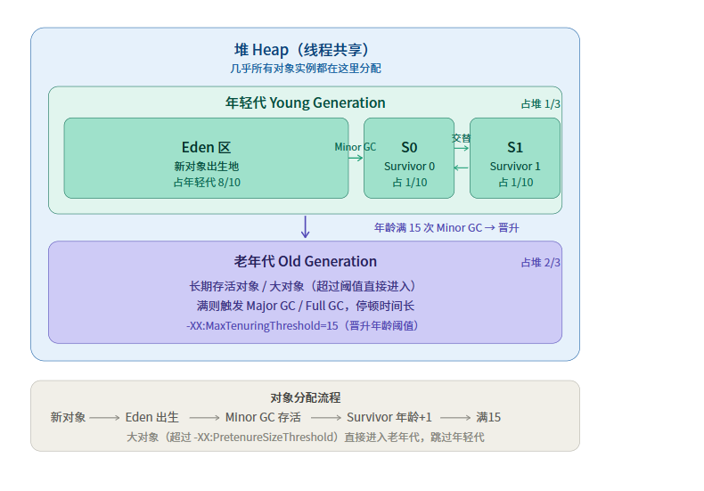
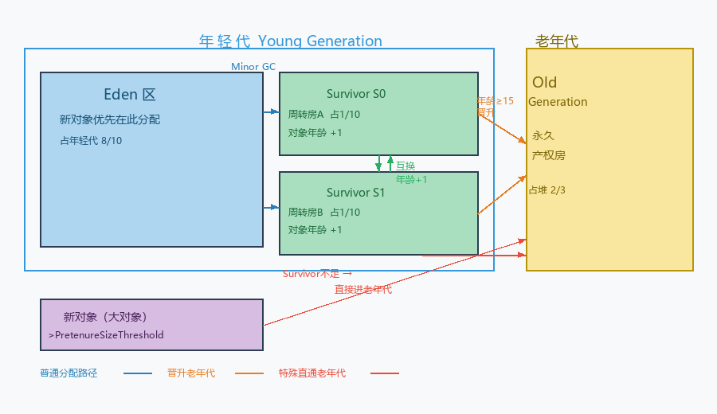
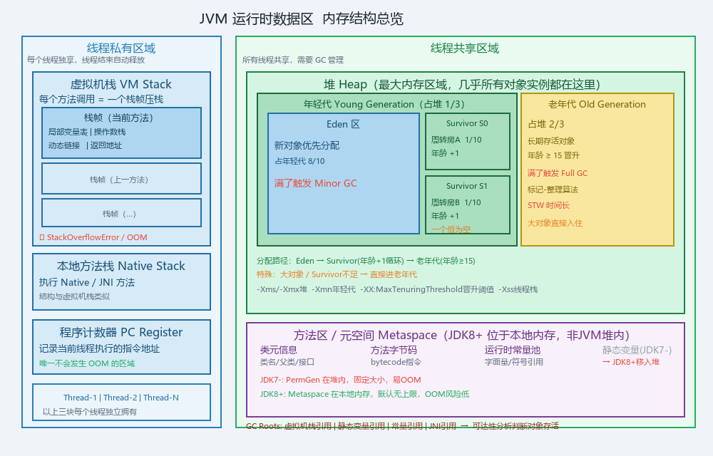

jvm/01-内存结构.md

# JVM 内存结构

## 一、整体划分
（线程共享 vs 线程私有，各放哪些区域）

### 1. JVM运行时数据区分为2类：

(1). **线程共享**（所有线程都能访问，需要GC）
- 堆 Heap
- 方法区(元空间)

(2). **线程私有**（每个线程独享，线程结束自动释放）
- 虚拟机栈
- 本地方法栈
- 程序计数器

**Q：JVM 运行时数据区哪些是线程共享的，哪些是线程私有的？**

>答：
>线程共享的有堆和方法区，线程私有的有虚拟机栈、本地方法栈、程序计数器。共享区域需要 GC 管理，也存在线程安全问题；私有区域随线程生命周期自动创建和销毁，不需要 GC。

## 二、堆 Heap
### 1. 作用
 堆是JVM最大的一块内存，所有线程共享，几乎所有的对象实例和数组都在堆上分配

### 2. 分代结构（年轻代/老年代）

- 年轻代占堆 1/3，老年代占堆 2/3
- 年轻代：Eden : S0 : S1 = 8 : 1 : 1

### 3. 对象分配流程
 堆想象成住宅小区

| JVM      | 小区            |
|----------|---------------|
| Eden区    | 新楼盘交付区（刚入住）   |
| S0/S1    | 2栋周转房（临期过渡）   |
| 老年代      | 永久产权正式住宅区     |
| Minor GC | 物业定期清查，清退不住的人 |
| Full GC  | 整个小区大清理       |
 完整流程：
- 第一步：新对象优先进Eden（绝大多数对象一出生就分配在Eden区，类似新居民入住新楼盘）
- 第二步：Eden满了，触发Minor GC（物业来清查，Eden区存活的对象【还有引用】,搬到S0【周转房】;死掉的直接清除）。
- 第三步：对象在S0/S1 反复搬家，年龄+1,每次Minor GC,S0存活的搬到S1，S1存活的搬到S0，每搬一次年龄+1（就像周转房里的住户，每次搬家都在，说明是真住户，有需求）
- 第四步:年龄到了，晋升老年代，默认年龄是15（-XX：MaxTenuringThreshold=15）,晋升老年代（就像周转房住够年限，分到正式产权房）
- 第五步：存在2种特殊情况直接进老年代，（1）：大对象，超过了-XX:PretenureSizeShelod阙值的对象，直接跳过Eden和Survivor，进入老年代（就像大家族来了，周转房根本住不下去，直接分配大户型正式住宅）;（2）Survivor装不下去：Minor GC 后存活对象太多，Survivor空间不足，直接晋升老年代。

如图所示：

说明：任何时刻，S0 和 S1永远只有一个在用，另一个必须是空的。Minor GC 触发时， Eden+S0 -> S1,然后 Eden+S0清空，S0和S1互换身份，下次Minor GC就是 Eden+S1 -> S0,这是复制算法的本质要求，目的是保证没有内存碎片。

**Q：对象什么时候进入老年代**
>答：
> 有4种情况：①:对象年龄超过阙值，默认15；②：大对象直接分配（超过PretenureSizeShelod）；③:Survivor空间不足，提前晋升，④：动态年龄判断，Survivor种的相同年龄对象总大小超过了空间大小的一半，则该年龄及以上直接晋升。

### 4. 常见JVM参数
| 参数                          | 含义               |
|-----------------------------|------------------|
| -Xms                        | 堆初始化大小           |
| -Xmx                        | 堆最大大小            |
| -Xmn                        | 年轻代大小            |
| -XX:SurvivorRatio=8         | Eden:S0:S1=8:1:1 |
| -XX:MaxTenuringThreshold=15 | 晋升老年代的年龄阙值       |

### 5. 触发 GC的条件

**面试题**
- Q：为什么要分代？
>答：绝大多数对象朝生夕死，少数对象长期存活，分代的目的是让不同声明周期的对象使用不同的GC算法，年轻代使用复制算法，GC快但频繁；老年代用标记整理，GC慢但触发少。这样每次Minor GC只扫描年轻代小区域，大幅减少STW时间，提升整体吞吐量，本质是用空间换时间，让高频GC只在小范围发生。

- Q：Minor GC 和 Full GC 的区别？
>答：Minor GC只针对年轻代，用复制算法，触发频繁但是STW时间短，对业务无影响。Full GC 针对整个堆+方法区，用标记-整理算法，STW时间长，触发有明显卡顿。

对比表

|       | Minor GC   | Full GC |
|-------|------------|---------|
| 触发条件  | 年轻代（Eden满） | 整个堆+方法区 |
| 算法    | 复制算法       | 标记-整理   |
| STW时间 | 短          | 长       |
| 触发频率  | 高          | 低       |
| 对业务影响 | 几乎无感       | 明显卡顿    |

- Q：什么情况触发 Full GC？
>答：主要有5种：①：老年代空间不足，大对象直接进入老年代，或年轻代持续晋升，导致老年代撑满了；②：Minor GC前空间担保失败；③：方法区空间不足（大量动态类加载）；④：显示调用system.gc() ⑤：CMS并发回收失败退化为Serial Old做Full GC，时间很长。

## 三、方法区
### 1、作用（存什么）
方法区是线程共享的区域，存的都是”类级别”的数据，跟具体对象实例无关。

| 存储内容 | 说明 |
|---------|------|
| 类的元信息 | 类名、父类、接口、访问修饰符 |
| 字段和方法信息 | 方法签名、参数、返回值 |
| 方法字节码 | 编译后的 bytecode 指令 |
| 运行时常量池 | 字面量、符号引用（如 `String s = “abc”` 里的 “abc”） |
| 静态变量 | static 修饰的字段（JDK8 后移到堆里） |

### 2. JDK8 前后的变化（PermGen → Metaspace）

**JDK7 及之前：永久代 PermGen**
- 方法区的实现叫**永久代**，位于 **JVM 堆内**
- 大小固定，默认 `-XX:MaxPermSize=256m`
- 问题：大量动态代理（Spring/MyBatis/CGLIB）或 JSP 生成大量 Class，容易撑满
- 报错：`java.lang.OutOfMemoryError: PermGen space`

**JDK8：移除 PermGen，改用 Metaspace（元空间）**
- 位于**本地内存（操作系统内存）**，不在 JVM 堆内
- 默认不限大小，用多少占多少（上限是物理内存）
- `-XX:MetaspaceSize=256m` 设初始大小，`-XX:MaxMetaspaceSize=512m` 设上限
- OOM 风险大幅降低，但设置不当仍会报：`java.lang.OutOfMemoryError: Metaspace`

**对比表**

| 对比项    | PermGen（JDK7-）  | Metaspace（JDK8+）     |
|--------|-----------------|----------------------|
| 位置     | JVM 堆内          | 本地内存                 |
| 大小     | 固定上限            | 默认无上限                |
| OOM 风险 | 高               | 低                    |
| 参数     | -XX:MaxPermSize | -XX:MaxMetaspaceSize |

### 3. 静态变量的位置变化

| JDK 版本 | 静态变量存在哪 |
|---------|-------------|
| JDK7 及以前 | 永久代（PermGen） |
| JDK8+ | 堆（Heap）中，跟 Class 对象一起 |

### 4. 方法区会 GC 吗

会，但条件苛刻，需同时满足三个条件才能回收一个类：
1. 该类所有实例都已被回收
2. 加载该类的 ClassLoader 已被回收
3. 该类的 Class 对象没有任何引用

普通业务类基本不会被回收，动态生成的类（CGLIB、反射）在框架热部署场景下才可能触发。

**Q：永久代和元空间的区别？**
>答：永久代是 JDK7 及以前方法区的实现，位于 JVM 堆内，大小固定，容易因大量动态类加载导致 OOM。JDK8 移除永久代，改用元空间，位于本地内存，默认不设上限，OOM 风险大幅降低。同时静态变量从永久代移到了堆中存储。

**Q：静态变量在哪里？**
>答：JDK7 及以前静态变量存在永久代（PermGen）中；JDK8 之后随着永久代被移除，静态变量存储在堆中，和对应的 Class 对象放在一起。

## 四、虚拟机栈

### 1. 作用
虚拟机栈是**线程私有**的，每个线程创建时都有一个独立的虚拟机栈。
每调用一个方法，就往栈里压一个**栈帧**；方法返回，栈帧出栈。

### 2. 栈帧结构（4个组成部分）

每个栈帧对应一次方法调用，包含4块内容：

| 组成部分 | 作用 |
|---------|------|
| 局部变量表 | 存方法的参数和局部变量；基本类型存值，引用类型存地址；大小编译期确定 |
| 操作数栈 | 字节码指令执行时的临时工作区，类似计算器，`a+b` 底层就是压栈后执行 `iadd` |
| 动态链接 | 持有指向运行时常量池中该方法的引用，将符号引用解析为直接引用，支撑多态 |
| 返回地址 | 记录方法执行完后回到哪里；正常返回恢复 PC 计数器，异常返回通过异常表跳转 |

**小区比喻：**
- 虚拟机栈 = 整栋电梯公寓
- 栈帧 = 每一层楼（每次方法调用占一层）
- 局部变量表 = 这层的房间（存变量）
- 操作数栈 = 这层的工作台（临时计算用）
- 方法调用链 = 从1楼坐电梯上去，return 就下来一层

### 3. 会抛什么异常

**① StackOverflowError**
- 栈帧太多，栈空间不够，最典型是无限递归
- 每个线程栈默认 512k ~ 1m，用 `-Xss` 调整

**② OutOfMemoryError**
- 线程数量过多，系统内存不足以为新线程分配虚拟机栈

**Q：虚拟机栈是什么，栈帧有哪些组成部分？**
>答：虚拟机栈是线程私有的，每次方法调用都会创建一个栈帧压入栈中，方法返回则出栈。栈帧包含四部分：局部变量表（存参数和局部变量）、操作数栈（字节码执行的临时工作区）、动态链接（运行时将符号引用解析为直接引用，支撑多态）、返回地址（记录方法执行完后回到哪里）。

**Q：虚拟机栈会抛什么异常？**
>答：两种。StackOverflowError：递归过深，栈帧数量超出栈的深度限制；OutOfMemoryError：线程数量过多，系统内存不足以为新线程分配虚拟机栈。

## 五、程序计数器
### 1. 作用
 程序计数器是线程私有的，每一个线程都有一个独立的程序计数器。它主要记录当前线程正在执行的字节码指令地址，可以理解为"下一条指要执行哪一个指令"的指针。JVM靠它去控制指令的顺序执行、循环跳转、异常处理、方法返回。

### 2. 为什么线程私有
 CPU 是多线程切换执行的，若是共有的，线程A执行到一半，切换线程B，之后再继续执行线程A，因为是线程共享，线程A不知道执行到哪一个指令了。
 
### 3. 唯一不会 OOM 的区域
 程序计数器只存一个指令地址，大小固定，JVM规范明确规定它不会抛出OutOfMemoryError.七个运行时数据区，唯一不会OOM的就是程序计数器。

**Q:程序计数器的作用是什么，为什么线程私有**
>答：程序计数器用于记录当前线程正在执行的字节码指令地址，JVM通过它去实现指令的顺序执行、跳转、循环和异常处理。线程私有是因为CPU是会在多个线程之间来回切换，每一个现线程需要一个独立的计数器才能保证切换后能够正确位置继续执行，线程之间互不干扰。

**Q:程序计数器会OOM吗**
>答：不会，程序计数器只存一个指令的地址，大小固定，是JVM规范唯一明确规定不会发生OOM的区域

## 六、GC Roots
### 1. 是什么
 GC在回收对象之前，需要判断那些对象"还活着"，那些可以回收。JVM用的是可达性分析算法：从一组称为GC Roots的根对象出发，沿着引用链往下找，能找到的对象就是存活的，找不到就是垃圾。
 
### 2. 包括哪些（4类）
| 类型           | 说明                          |
|--------------|-----------------------------|
| 虚拟机栈中的引用     | 各线程当前方法的局部变量、参数引用的对象        |
 | 方法区的静态变量引用   | static修饰的变量引用的对象            |
| 方法区中常量引用     | 常量池里的引用，如 static final引用的对象 |
| 本地方法栈中的JNI引用 | Native方法引用的对象               |

### 3. 为什么不用引用计数法
 引用计数法的思路：每一个对象维护一个计数器，被引用一次+1，引用消失-1，计数为0则回收。但是存在致命缺陷：无法解决循环引用

## 七、面试高频题
**Q：对象引用在哪，对象本体在哪**
>答：对象的本地（示例数据）肯定是堆上，对象的引用，要看声明在何处

| 引用生命的位置                  | 引用存放位置            |
|--------------------------|-------------------|
| 方法内的局部变量 User user=      | 虚拟机栈（局部变量表）       |
| 类的成员变量 Private User user | 堆（跟实例对象放在一起）      |
| 静态变量static User user     | JDK8前在方法区，JDK8后在堆 |
 

**Q：静态变量在哪里？（JDK8前后不同）**
>答：JDK7 及以前静态变量存在永久代（PermGen）中；JDK8 之后随着永久代被移除，静态变量存储在堆中，和对应的 Class 对象放在一起。

**Q：程序计数器会 OOM 吗？**
>答：不会，程序计数器只存一个指令的地址，大小固定，是JVM规范唯一明确规定不会发生OOM的区域

**Q：永久代和元空间的区别？**
>答：永久代是 JDK7 及以前方法区的实现，位于 JVM 堆内，大小固定，容易因大量动态类加载导致 OOM。JDK8 移除永久代，改用元空间，位于本地内存，默认不设上限，OOM 风险大幅降低。同时静态变量从永久代移到了堆中存储。

## 8.JVM运行时区的结构总览图

