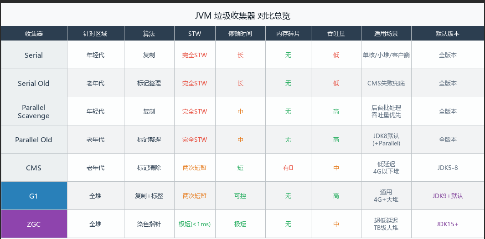

# JVM 垃圾回收

## 一、三种基础 GC 算法
### 1. 标记-清除（Mark-Sweep）

 两个阶段
- 标记：从GC Roots出发，标记所有存活的对象
- 清除：把没有标记的对象直接清掉

小区比喻：物业挨家挨户贴标签，有人住的贴"保留"，没人住的补贴。贴完后，把没有标签的房间直接拆除掉。

缺点：
- 清除后留下的大量内存碎片，小碎片连大对象都放不进去
- 标记和清除2次扫描，效率一般

### 2. 复制算法（Copying）
思路：把内存分为2块，每次只用一块，GC时把存活对象复制到另一块，然后把当前这块全部清空。

小区比喻：小区有A,B 2栋楼，平时只住A栋。清查时，把A栋住的人搬到B栋，然后将A栋推到重建。下次再搬回B栋。

优点：
- 没有内存碎片，复制完就是连续的内存。
- 实现简单，速度块

缺点：
- 始终浪费一半的内存空间
- 存活对象多时，复制成本高

适用场景：年轻代 GC回收

### 3. 标记-整理（Mark-Compact）
三个阶段：
- 标记：同标记-清除，标记存活对象
- 整理：把存活对象向一端移动，排列紧凑
- 清除：把边界以外的内存全部清掉

小区比喻：物业清查后，不是直接拆空房子，而是把所有的住户都往左边挤，住满左边，然后把右边全部清空。

优点：
- 没有内存碎片
- 不浪费空间

缺点：
- 需要移动对象，速度比复制算法慢
- 移动需要STW，停顿时间长

适用场景：老年代

### 4. 三者对比（碎片/效率/适用场景）
| 维度    | 标记-清除  | 复制算法 | 标记-整理 |
|-------|--------|------|-------|
| 内存碎片  | 有      | 无    | 无     |
| 内存利用率 | 高      | 低    | 高     |
| 速度    | 一般     | 快    | 慢     |
| STW时间 | 短      | 短    | 长     |
| 适用场景  | 基础/老年代 | 年轻代  | 老年代   |

**Q:JVM有几种GC算法，各有什么缺点？**
>答：3种基础算法。标记-清除：实现简单但是产生内存碎片；复制算法：无碎片速度快，但是始终浪费一半内存，适合存活率低的年轻代；标记-整理：无碎片且内存利用率高，但移动对象代价大，适合老年代。实际JVM是分代组合的，年轻代用的复制算法，老年代用的标记-整理。

## 二、分代收集策略
- 为什么年轻代用复制，老年代用标记整理
- Minor GC / Full GC 回顾（见 01-内存结构）

## 三、垃圾收集器

### 1. Serial / Serial Old（了解）
  Serial(年轻代)：单线程，独占式，GC只有一条线程来回收，并且回收期间必须暂停所有用户线程（STW），等GC完成才继续。
  
  比喻：清洁工只有一个人，打扫期间整个小区封闭，所有住户停止活动，等他一个人打扫完在开门。

- 算法：复制算法
- 参数：-XX:UseSerialGC

 Serial Old(老年代):Serial的老年代版本，同样单线程，同样STW
- 算法：标记-整理
- 现在主要作为CMS失败后的兜底收集器

### 2. Parallel Scavenge / Parallel Old（吞吐量优先）
  
   Parallel Scavenge(年轻代)：多线程，但仍然STW，目标是最大吞吐量，和Serial的区别就是GC时是多条线程同时并行回收，速度更快，但仍然会STW
   
   小区比喻：从一个清洁工变成一个清洁队，多人同时打扫，速度快了，但打扫期间小区仍然还是封闭的。
   
- 算法：复制算法（年轻代）
- 核心目标:吞吐量优先

说明：吞吐量 = 用户代码运行时间/（用户代码运行时间+GC时间）

  Parallel Old（老年代）：Parallel Scavenge的老年代搭档，同样多线程，同样STW。

- 算法：标记-整理
- JDK8默认就是 Parallel Scavenge + Parallel Old的组合

核心参数：

| 参数                       | 含义                      |
|--------------------------|-------------------------|
| -XX:MaxGCPauseMillis=200 | 最大停顿时间目标（毫秒），设小了会牺牲吞吐量  |
| -XX:GCTimeRatio=99       | 吞吐量目标，99 表示 GC 时间不超过 1% |
| -XX:+UseParallelGC       | 开启 Parallel Scavenge    |
| -XX:ParallelGCThreads=4  | GC 线程数，默认等于 CPU 核数      |
  

**Q:Parallel Scavenge 和 Serial 的区别**
>答：两者都会STW，区别是Serial单线程回收，Parallel Scavenge多线程并行回收。Parallel Scavenge以吞吐量为目标，适合后台批处理等对停顿时间不敏感，但希望CPU更多用于业务的场景。JDK 8 默认用的是Parallel Scavenge + Parallel Old组合。

### 3. CMS（重点）
 
 CMS: 全称Concurrent Mark Sweep，设计目标，低延迟，减少STW时间，前面的Serial和Parallel在GC时都是完全STW，CMS的思路是：能并发的阶段就和用户线程同时跑，尽量压缩STW的时间。

- 算法：标记-清除（老年代）
- 参数：-XX:UseConcMarkSweepGc

 四个阶段：
 - ①初始标记（Initial Mark）-STW，很短，只标记 GC Roots直接关联的对象，不往下追，范围小，停顿短。
 - ②并发标记（Concurrent Mark）- 不 STW，最耗时，从上一步标记的对象出发，和用户线程并发，顺着引用链把所有的存活对象都标记一遍。这个阶段最耗时，但不停顿业务。
 - ③重新标记（Remark）-STW,较短，并发标记期间用户线程还在跑，可能改变了引用关系，需要重新修正，比初始标记稍长，但远比并发标记短。
 - ④并发清除（Concurrent Sweep） -不 STW,和用户线程并发，清除没有标记的垃圾对象

 缺点：
 - 浮动垃圾(Floating Garbage)：并发清除阶段用户线程还在跑，会产生新的垃圾，但这批垃圾本次GC已经标记完，标记不到，只能留着下次GC回收，这批垃圾属于浮动垃圾，是CMS并发设计的固有代价。
 - 内存碎片：CMS用的是标记-清除算法，清楚后不整理，会产生大量的内存碎片，碎片多了，大对象分配不了，提前触发 Full GC.
 - Concurrent Mode Failure（并发模式失败）:CMS并发清理期间老年代不够用了（新晋升+浮动垃圾），CMS来不及回收，直接退化Serial Old做 Full GC,STW 时间会非常长。所以不能等老年代满了才触发，默认是92%就是开始GC

CMS参数：
- -XX:+UseCMSCompactAtFullCollection  #Full GC时做整理 
- -XX:CMSFullGCsBeforeCompaction=5   # 每5次Full GC做一次整理 
- -XX:CMSInitiatingOccupancyFraction=92  # 老年代占比达到92%触发CMS

**Q:CMS的回收过程是什么？**
>答：CMS分为4个阶段，初始化标记阶段：会STW,只标记GC Roots直接关联的对象，并发标记：与用户线程并发，遍历整个引用链，重新标记：STW，修正并发标记期间变动的对象，并发清除：与用户线程并发，清除垃圾。只有初始化标记，重新标记需要STW，STW时间很短，整体实现低延迟。

**Q:CMS有那些缺点?**
>答：三个缺点：浮动垃圾：并发清除阶段新产生的垃圾本次不会回收，只能下次回收；内存碎片：使用标记-清除算法，不整理内存，碎片多了导致大对象分配失败提前触发Full GC;Concurrent Model Failure：并发回收期间老年代放不下新晋升对象，退化为Serial Old 做Full GC 停顿时间反而更长。

### 4. G1（重点，现在主流）
 G1: Garbage First，设计目标是可预测的停顿时间+高吞吐量，2者兼顾，CMS只管老年代，G1是全堆收集器，年轻代老年代都管。JDK9开始成为默认收集器。

#### 4.1 Region 设计
 CMS/Parallel 把堆分成了固定的年轻代/老年代区域。G1把整个堆切成很多大小相等的Region（默认2048），每一个Region动态扮演不同的角色。
 - E= Eden
 - S= Survivor
 - O= Old
 - H= Humongous(大对象)

| Region类型  | 说明                     |
|-----------|------------------------|
| Eden      | 新对象分配                  |
| Survivor  | Minior GC存活对象          |
| Old       | 长期存活对象                 |
| Humongous | 超过Region大小50%的大对象，直接分配 |

说明：Region可以动态调整角色，不像CMS老年代大小固定死的.G1会追踪每一个Region的回收价值（垃圾量/回收耗时），每次GC优先回收价值最高的Region。

参数：
 -XX:MaxGCPauseMillis =200  # 目标每次GC不超过200ms
G1 在这 200ms 内尽量多收，收不完的下次再收。Garbage First 就是这个意思——优先回收垃圾最多的 Region。

#### 4.2 四个阶段
- ①初始化标记：-STW，很短，标记GC Roots直接关联的对象，和CMS一样。
- ②并发标记：-不STW,并发遍历整个堆的引用链，标记存活对象，同时记录那些Region垃圾最多。
- ③最终标记：-STW，较短，修正并发标记期间变动的对象，和CMS重新标记一样。
- ④筛选回收：-STW，根据停顿时间目标，选出价值最高的若干Region，把存活的对象复制到空的Region，然后清空原Region.

#### 4.3 与 CMS 的区别

| 对比维度  | CMS    | G1            |
|-------|--------|---------------|
| 针对区域  | 仅老年代   | 全堆            |
| 算法    | 标记-清除  | 复制算法          |
| 内存碎片  | 有      | 无             |
| 停顿时间  | 不可预测   | 可设目标          |
| 适用堆大小 | 4G以下   | 4G以上更有优势      |
| 默认版本  | JDK5-8 | JDK9+         |
 | 浮动垃圾  | 有      | 有（并发标记阶段同样存在） |

**Q:G1与CMS的区别?**
>答：主要有4点区别：①回收范围：G1全堆收集器，CMS只回收老年代；②内存模型：CMS按代划分固定区域，G1把堆切成等大的Region,动态分配角色，灵活性高；③算法：CMS使用标记-清除算法 ，有内存碎片，G1筛选回收阶段用复制算法，无碎片。④：停顿可预测：G1可通过MaxGCPauseMillis设置停顿时间目标，优先回收垃圾最多的Region,CMS无法预测停顿时间。

**Q:G1为什么可以预测停顿时间？**
>答：G1会统计每一个Region的回收价值（垃圾量和回收耗时的比值），每次GC在设定的停顿时间预算内，优先选择回收价值最高的Region回收，时间到了就停，剩下的下次再回首，这就是Garbage First名字的由来。
 
### 5. ZGC（了解）
超低延迟，STW 时间控制在 10ms 以内，甚至 1ms 以内。 G1 已经很好了，但筛选回收阶段还是 STW，堆越大停顿越长。ZGC 的目标是：无论堆多大（TB级别），停顿时间都不随堆大小增长。

- JDK11 引入（实验性），JDK15 正式可用
- 参数：-XX:+UseZGC

2大特性：
- 染色指针（Colored Pointer）：把标记信息直接存在对象引用指针里（利用64位地址的高位几个bit），不需要额外的标记表，GC 标记和对象移动可以并发进行。
- 读屏障（Load Barrier）：每次程序读取对象引用时，JVM 插入一小段检查代码，确保拿到的是对象移动后的新地址。这样对象移动可以和用户线程并发进行，不需要 STW。

**Q:ZGC了解？**
>答：ZGC 是 JDK11 引入、JDK15 正式可用的低延迟收集器，目标是将 STW 时间控制在 10ms 以内，且停顿时间不随堆大小增长，支持 TB 级别的堆。核心技术是染色指针和读屏障，使得对象标记和移动可以与用户线程完全并发执行。代价是 GC
线程会占用更多 CPU 资源。适合对延迟极度敏感、堆内存很大的场景，比如实时交易、大数据处理。

### 6. 收集器对比表

## 四、STW（Stop The World）

### 1. 什么是 STW
 GC发生时，JVM强制暂停所有用户线程，只让GC线程工作，等GC完成后用户线程才继续运行。这段暂停时间就叫做STW(Stop The World)
 

### 2.为什么必须STW
 GC需要分析对象的引用关系，如果用户线程还在跑，应用关系一直在变，GC分析的结果就不准确，可能：
- 把还活着的独享当垃圾回收掉 → 程序崩溃
- 把已经死掉的对象漏掉 → 内存泄露

### 3. 哪些阶段会 STW
| 收集器             | STW阶段          | STW时长 |
|-----------------|----------------|-------|
| Serial/Parallel | 整个GC过程         | 长     |
| CMS             | 初始标记+重新标记      | 短     |
| G1              | 初始标记+最终标记+筛选回收 | 可控    |
| ZGC             | 初始标记+最终标记      | <1ms  |

### 4. STW对业务的影响
| STW时长      | 用户感知       |
|------------|------------|
| <50ms      | 几乎无感       |
| 50ms~200ms | 偶尔接口超时     |
| >200ms     | 明显卡顿，超时报警  |
| 秒级         | 大量超时，服务不可用 |

生产上 Full GC 导致的 STW 经常是秒级，这就是为什么要避免频繁 Full GC。

### 5. 如何减少 STW 时间
①选合适的收集器
- 延迟敏感（接口服务）→ G1/ZGC
- 吞吐量优先（批处理）→ Parallel

②合理设置堆大小
- 堆大小 → GC频繁
- 堆太大 → 每次GC扫描范围大，STW时间长
-  一般建议堆大小不超过物理内存的1/4~1/2

③避免频繁Full GC
- 不要用大对象（拆分或者复用）
- 不要在代码里调用System.gc()
- 控制老年代晋升速度

**Q:什么是STW,如何减少STW的影响？**
>答：STW是GC时JVM强制暂停所有用户线程的机制，目的是保证GC期间对象引用关系不变，确保回收结果正确，STW过长会导致接口超时、服务卡顿、减少STW影响的方式：选用低延迟收集器（G1/ZGC)、合理设置堆大小、避免大对象和频繁Full GC、用G1的MaxGCPauseMillis控制停顿目标。

## 五、OOM 排查思路

### 1. 常见 OOM 类型（堆/栈/元空间）
| OOM类型 | 报错信息               | 原因         |
|-------|--------------------|------------|
| 堆溢出   | Java Heap space    | 对象太多，堆放不下去 |
| 栈溢出   | StackOverflowError | 递归太深、栈桢太多  |
| 元空间溢出 | Metaspace          | 动态类加载太多    |

### 2. 排查步骤：GC日志 → heap dump → MAT分析

### 3. 常用命令：jstat / jmap / jstack
-  jstat -gc <pid> 1000    # 查看堆内存使用情况（实时）
-  jmap -histo <pid> | head -20    # 查看堆中对象分布（Top20）
-  jmap -dump:format=b,file=heapdump.hprof <pid>  # 抓堆快照
-  jstack <pid>   # 查看线程栈（排查死锁/线程OOM）
-  jinfo -flags <pid>  # 查看JVM基本信息

## 六、面试高频题
**CMS 和 G1 的区别？**
>答：主要有4点区别：①回收范围：G1全堆收集器，CMS只回收老年代；②内存模型：CMS按代划分固定区域，G1把堆切成等大的Region,动态分配角色，灵活性高；③算法：CMS使用标记-清除算法 ，有内存碎片，G1筛选回收阶段用复制算法，无碎片。④：停顿可预测：G1可通过MaxGCPauseMillis设置停顿时间目标，优先回收垃圾最多的Region,CMS无法预测停顿时间。

**G1 为什么能预测停顿时间？**
>答：G1会统计每一个Region的回收价值（垃圾量和回收耗时的比值），每次GC在设定的停顿时间预算内，优先选择回收价值最高的Region回收，时间到了就停，剩下的下次再回首，这就是Garbage First名字的由来。

**什么是浮动垃圾？**
>答： CMS 和 G1 的并发标记阶段，GC 线程和用户线程同时运行，用户线程可能在标记过程中把某些对象的引用置为 null，这些对象变成了垃圾。 但 GC 已经标记完了，来不及回收，只能留到下次 GC 才能清掉。 这批"本次应该回收但没收掉"的垃圾就叫浮动垃圾。

**对象一定在堆上分配吗？**
>答：不一定，JVM 有两个优化：
> - ① 栈上分配 如果对象不会逃逸出方法（只在方法内用），JIT 编译器可以直接在栈上分配，方法结束自动释放，不需要 GC。
> - ② TLAB（Thread Local Allocation Buffer）,每个线程在 Eden 区预先分配一小块私有内存，对象优先在 TLAB 里分配，避免多线程竞争堆内存的锁开销。
> - 对象优先在堆上分配，但 JIT 逃逸分析后可能栈上分配；线程内部分配走 TLAB 快速通道。

**Minor GC 会扫描老年代吗？**
>答：会，但不是全扫。年轻代对象可能被老年代对象引用，如果 Minor GC 只扫年轻代，可能把被老年代引用的对象误判为垃圾回收掉。JVM 用卡表（Card Table）解决这个问题：把老年代分成若干个卡页，只要老年代某个卡页里有对象引用了年轻代，就把这个卡页标记为脏页。Minor GC 时只扫描脏页，不用扫整个老年代，效率高。
