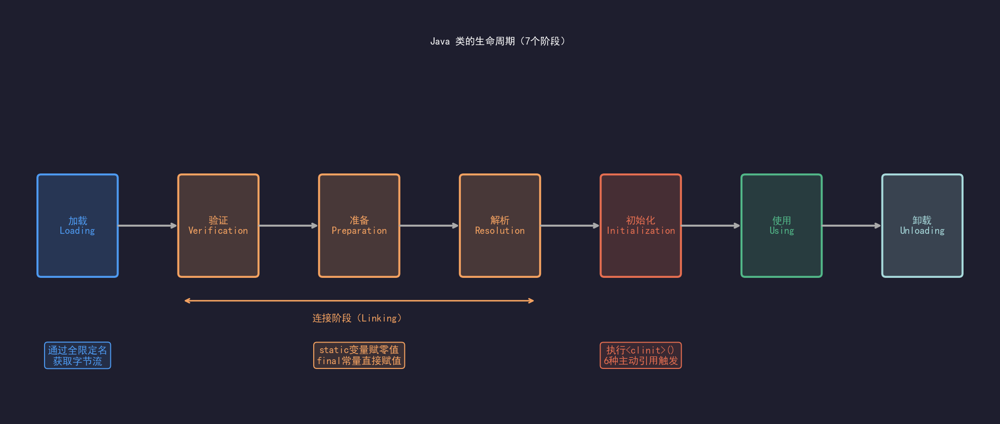

# 三、类加载机制与双亲委派模型

## 一、类的生命周期（7个阶段）

1. 加载（Loading）
2. 验证（Verification）
3. 准备（Preparation）
4. 解析（Resolution）
5. 初始化（Initialization）
6. 使用（Using）
7. 卸载（Unloading）

> 重点：验证/准备/解析合称"连接"阶段

如图所示：

---

## 二、各阶段详解

### 1. 加载
- 通过全限定类名获取二进制字节流
- 将字节流代表的静态结构转化为方法区运行时数据结构
- 堆中生成对应的 java.lang.Class 对象

   
JVM通过类的全限定名（如 com.demo.User）找到字节流（.class文件），把它转化成方法区的运行时数据结构，同时在堆上生成一个java.lang.Class对象作为入口。

### 2. 验证
保证字节流不会危害JVM安全，分为4步：
- 文件格式验证：魔数是不是0xCAFEBABE，版本号是否支持
- 元数据验证：类继承关系是否合法
- 字节码验证：指令逻辑是否合法（最耗时）
- 符号引用验证：引用的类/方法/字段 是否存在且有权限访问


### 3. 准备
- 为类变量（static）分配内存，赋零值
- 注意：此时不执行赋值代码，final static 常量除外

```
public static int value = 123;
// 准备阶段结束后，value=0,不是123。赋值123的代码在初始化阶段才执行。
public static final int value = 123;
// final static 常量，编译时就写入ConstantValue属性，准备阶段直接赋值。
```

### 4. 解析
- 将符号引用替换为直接引用
 符号引用就是字符串形式的描述（比如com/demo/User）,直接引用是内存地址或者偏移量。解析的对象包括类、字段、方法。


### 5. 初始化（重点）
- 执行 <clinit>() 方法（类构造器）
- 触发初始化的6种主动引用场景：
  1. new 实例化对象
  2. 读写类的静态字段（非 final）
  3. 调用类的静态方法
  4. 反射调用
  5. 初始化子类时父类未初始化
  6. JVM 启动时的主类

执行类构造器<clinit>()方法。这个方法是编译器自动合并所有static变量赋值和static{}代码块生成的。JVM保证<clinit>()方法在多线程环境只执行一次，并且有同步锁保护。


### 6.使用/卸载
  正常使用。卸载条件非常苛刻：该类的所有实例被回收 + ClassLoader 被回收 + Class 对象没有引用，三个条件同时满足才能卸载。
  这个阶段与GC的关系？


**Q：static 变量和 static final 变量在类加载哪个阶段赋值，有什么区别？**
>答：static 变量在准备阶段赋零值，初始化阶段执行赋值代码。static final 常量（编译期常量）在准备阶段直接赋真实值，不需要等到初始化阶段。

**Q：<clinit>() 和 <init>() 的区别？**
>答：<clinit>() 是类构造器，处理 static 变量和 static 块，类加载时执行一次。<init>() 是实例构造器，每次 new 对象时执行，对应代码里的构造方法和实例变量初始化。

---

## 三、类加载器分类

| 加载器                     | 名称     | 负责范围                  |
|-------------------------|--------|-----------------------|
| Bootstrap ClassLoader   | 启动类加载器 | JAVA_HOME/lib（rt.jar） |
| Extension ClassLoader   | 扩展类加载器 | JAVA_HOME/lib/ext     |
| Application ClassLoader | 应用类加载器 | classpath             |
| 自定义 ClassLoader         | -      | 用户自定义路径               |

### 1.Bootstrap ClassLoader
- C++实现，是JVM自身的一部分，不是Java对象
- 负载加载 JAVA_HOME/lib下的核心类库（rt.jar、charsets.jar等）
- 只加载包名为 java.*、javax.*、sun.*类

```
System.out.println(String.class.getClassLoader());
// 输出：null
// null 就代表 Bootstrap，因为它在 Java 层没有对象
```

### 2.Extension ClassLoader(扩展类加载器)
- Java实现，sun.misc.Launcher$ExtClassLoader
- 负载加载 JAVA_HOME/lib/ext 目录下的jar包
- JDK 9 以后改为 Platform ClassLoader，概念一样

### 3. Application ClassLoader(应用类加载器)
- Java实现，sun.misc.Launcher$AppClassLoader
- 负责加载classpath下的类，也就是我们自己写的业务代码
- ClassLoader.getSystemClassLoader()返回的就是应用类加载器
- 默认的类加载器，没有自定义的情况下所有业务类都由它加载

```
System.out.println(BlCase.class.getClassLoader());
// 输出sun.misc.Launcher$AppClassLoader@18b4aac2
```

### 4. Custom ClassLoader(自定义类加载器)
- 继承ClassLoader,重写findClass()
- 父加载器默认是Application ClassLoader


**Q:getClassLoader() 返回 null 是什么意思？**
>答：表示该类由Bootstrap ClassLoader 加载，因为BootStrap是C++实现，Java层没有对象，所以返回null

**Q:同一个 .class 文件被两个不同 ClassLoader 加载，是同一个类吗？**
>答：不是，JVM判断两个类是否相同，要求全限定名相同+加载它的ClassLoader相同，缺一不可。两个ClassLoader 加载同一个文件，得到的是2个独立的Class对象，互相强转会抛出ClassCastException。


---

## 四、双亲委派模型

### 工作流程
1. 收到加载请求，先委托父加载器处理
2. 父加载器无法完成时，才由自己加载

工作流程代码描述：

```text
自定义 ClassLoader.loadClass("com.demo.User")
├─→ 先委托 Application ClassLoader
│       │
│       ├─→ 先委托 Extension ClassLoader
│       │       │
│       │       ├─→ 先委托 Bootstrap ClassLoader
│       │       │       │
│       │       │       └─→ 在 rt.jar 里找不到 com.demo.User
│       │       │               ↓ 返回"找不到"
│       │       │
│       │       └─→ Extension 在 lib/ext 里找，也找不到
│       │               ↓ 返回"找不到"
│       │
│       └─→ Application 在 classpath 里找到了 加载返回
│
└─→ 如果 Application 也找不到，自定义 ClassLoader 才自己加载
```

```
  protected Class<?> loadClass(String name, boolean resolve) throws ClassNotFoundException {
      synchronized (getClassLoadingLock(name)) {
          // 1. 先查缓存，已加载过直接返回
          Class<?> c = findLoadedClass(name);

          if (c == null) {
              try {
                  // 2. 有父加载器就委托父加载器
                  if (parent != null) {
                      c = parent.loadClass(name, false);
                  } else {
                      // 3. 父为 null 说明父是 Bootstrap，直接找 Bootstrap
                      c = findBootstrapClassOrNull(name);
                  }
              } catch (ClassNotFoundException e) {
                  // 父加载器找不到，异常吞掉，轮到自己
              }

              if (c == null) {
                  // 4. 父加载器都找不到，自己找
                  c = findClass(name);  // ← 自定义类加载器只需重写这个
              }
          }
          return c;
      }
  }

```


### 为什么这样设计？（面试高频）
- 安全性：防止核心类被替换（如自定义 java.lang.String）
- 避免重复加载：同一个类只加载一次

 说明： 
 1. 避免重复加载的直接手段是 findLoadedClass() 缓存，双亲委派的作用是保证同一个类的加载请求最终都汇聚到同一个加载器上，让缓存能够命中。两者是协作关系
 2. 每一个ClassLoader实例内部维护了一个自己的缓存表（native层实现），记录加载过哪些类。

>代码示例：`src/main/java/com/learn/jvm/classloader/ParentsDelegationDemo.java`
 
  结论：类是谁加载的，取决于委派链上第一个成功加载它的加载器，跟请求从哪里发起无关。

### 打破双亲委派的场景（重点）
#### 1. **JNDI / SPI 机制** — 线程上下文类加载器（ContextClassLoader）

>代码示例：`src/main/java/com/learn/jvm/classloader/SpiDemo.java`

 
> 总结：SPI 的矛盾是：接口在上层（Bootstrap），实现在下层（classpath），上层代码加载不到下层的类。线程上下文类加载器的本质是给上层代码塞一个下层的加载器，绕过双亲委派的方向限制，让 Bootstrap 层的代码能借助 Application ClassLoader 加载
classpath 里的实现类。
 
#### 2. **Tomcat** — 每个 WebApp 有独立的 WebAppClassLoader，隔离不同应用

> 源码：src/main/java/com/learn/jvm/classloader/CustomClassLoaderDemo.java

> 总结：Tomcat 重写 loadClass()，让 WebAppClassLoader 优先加载自己 WEB-INF/lib 下的类，加载不到才委托父加载器。每个 WebApp 独立的 ClassLoader 实例保证了各自的类版本隔离，java.* 等核心类仍然兜底给 Bootstrap，安全性不受影响。


#### 3. **热部署** — 替换 ClassLoader 实现类的热替换
>代码示例：`src/main/java/com/learn/jvm/classloader/HotDeployDemo.java`

>总结：热部署的核心是替换 ClassLoader 实例，而不是重新加载类。旧 ClassLoader 能否被 GC 回收决定了 Metaspace 能否释放。只要有任何一条强引用链从 GC Root 指向旧 ClassLoader，就会造成 Metaspace 泄漏，频繁热部署后必然 OOM。
---

## 五、自定义类加载器

- 继承 ClassLoader，重写 findClass()
>答：重写findClass，委托流程不变，先问父，父找不到再来找自定义。重写loadClass,委派流程完全由自己控制，可以改变先问谁，比如Tomcat的类隔离。

- 使用场景：加密 Class 文件、从网络/数据库加载、热部署

---

## 六、常见面试题
**Q:说下类的生命周期?**
>答：7个阶段，加载、验证、准备、解析、初始化、使用、卸载，其中验证、准备、解析合成连接阶段。顺序上，解析可以在初始化以后（支持动态绑定），其他顺序固定。

**Q:准备阶段和初始化阶段对static变量的处理有什么区别？**
>答: 准备阶段给static变量分配内存并赋零值，初始化阶段才执行赋值代码和static块。例外，static final 编译期常量在准备阶段赋真实值。

**Q：双亲委派模型的作用？**
>答：
> - 安全性，核心类库由BootStrap加载，自定义的同名类无法替换（比如自定义java.lang.String 永远不会被加载）
> - 唯一性：同一个类的加载请求最终汇聚到同一个类加载器上，配合缓存保证全局只有一个Class对象。

**Q：如何打破双亲委派？举个实际例子？**
>答：打破方式是重写ClassLoade的loadClass方法，改变委派逻辑
> - Tomcat：WebAppClassLoader重写loadClass(),优先加载自己WEB-INF/lib下的类，实现多WebApp类版本隔离
> - SPI：BootStrap层的DriverManager需要加载classpath下的MySQL Driver，通过线程上下文类加载器反向委托AppClassLoader完成加载的。

**Q：Tomcat 为什么要破坏双亲委派？**
>答：2个原因：
> - 类版本隔离，不同的WebApp可能依赖同一个库的不同版本，如果走标准的双亲委派，AppClassLoader加载一个版本后缓存命中，所有的WebApp拿到的都是一个版本，导致版本冲突。每一个WebApp独立的ClassLoader才能加载各自的版本。
> - 安全隔离：Webapp A类不应该对 WebApp B可见。独立的ClassLoader天然隔离。

**Q：getClassLoader（）返回null是什么意思，怎么判断一个类由BootStrap加载？**
>答：返回null表示该类由BootStrap ClassLoader加载。BootStrap是由C++实现，在java层咩有对象，所以返回null。判断方式亦是如此。

**Q：类初始化和对象初始化的区别？**
>答：
> - 类初始化，执行<clinit>()，处理的static变量赋值和static块，整个生命周期只执行一次，JVM保证线程安全。
> - 对象初始化，执行<init>()，处理实例变量赋值和构造方法，每次new都执行。
> - 执行顺序： 父类（clinit）-> 子类（clinit）-> 父类（init）-> 子类（init）
> - 触发类初始化的情况
>  1. new 实例化对象
>  2. 访问类的静态字段（非final）
>  3. 调用类的静态方法
>  4. 反射调用Class.forName()
>  5. 初始化子类时，父类未初始化则先初始化父类
>  6. JVM启动时的主类


**Q：同一个 Class 文件被两个 ClassLoader 加载，是同一个类吗？**
>答：不是。JVM判断两个类是否相同，要求全限定名相同且ClassLoader相同，缺一不可。两个不同ClassLoader加载同一个文件时，得到两个独立的Class对象，互相强转会抛出ClassCastException.
