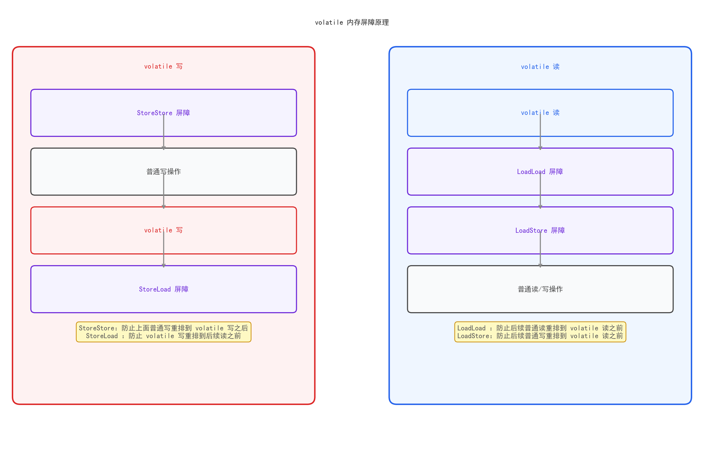
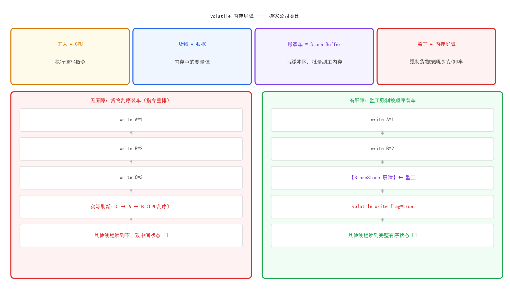
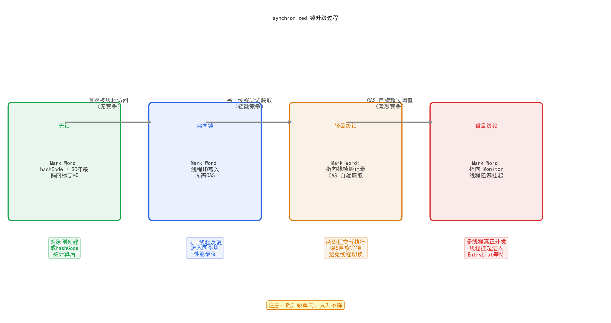
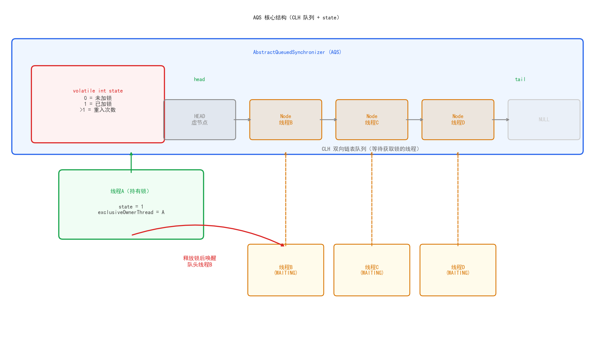
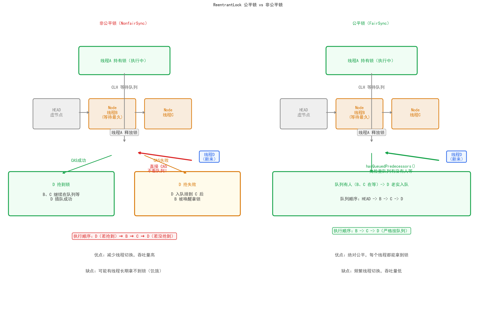

# 四、JUC 并发                                            

## 一、Java 内存模型（JMM）
### 1. 为什么需要 JMM（CPU 缓存、指令重排问题）
现代CPU为了 提升性能，做了2件事情，直接导致并发问题：
- 多级缓存
- 指令重排序

多级缓存
 ```txet
  CPU Core1         CPU Core2
    L1 Cache           L1 Cache
    L2 Cache           L2 Cache
           L3 Cache(共享)
             主内存（RAM）
  
  每个核心有自己的缓存，变量从主内存读到缓存后，各自修改，互相看不到。这就是可见性问题。
  ``` 
>**指令重排序**:CPU和编译器为了优化执行效率，会对指令重新排序，只保证单线程结果正确，但多线程会出现问题，这就是有序性问题。

总结：JMM 就是Java对这2个问题定义的一套规范，告诉JVM和CPU，什么时必须把数据同步到主内存，什么时候不能重排序。

### 2. 主内存与工作内存
JMM 将内存抽象成两层：
- 主内存：存放所有共享变量（实例字段、静态字段）
- 工作内存：每一个线程私有，存放该线程用到的变量副本

线程读变量：从主内存拷贝到工作内存
线程写变量：写到工作内存，再刷回主内存

注意：工作内存是JMM的抽象概念。

### 3. 三大特性：可见性、原子性、有序性
- 可见性：一个线程修改了共享变量，其他线程能立即看到。
- 原子性：一个操作不可被中断，要么全部执行，要么不执行。
- 有序性：程序执行顺序按代码顺序，不能随意重排。

### 4. happens-before 原则（8条规则）
JMM用happends-before来描述两个操作之间的内存可见性：如果A happens-before B,则A的结果对B可见。

8条规则

| 规则          | 说明                                              |
|-------------|-------------------------------------------------|
| 程序顺序规则      | 同一个线程内，前面的操作happens-before 后面的操作                |
| Monitor 锁规则 | unlock happends-before 后续的lock(synchronized的基础) |
| volatile规则  | 写volatile变量happens-before后续读该变量                 |
| 传递性规则       | A hb B ,B hb C, 则 A hb C                        |
| 线程启动规则      | Thread.start() happens-before 线程内任何操作           |
| 线程终止规则      | 线程所有操作 happens-before Thread.join()返回           |
| 中断规则        | interrupt() happens-before 检测到中断                |
| 对象终结规则      | 构造方法结束 happens-before finalize()                |

```text
天然成立（不用管）
├── 规则1：同线程顺序
├── 规则5：线程启动
├── 规则6：线程终止
├── 规则7：中断
└── 规则8：对象终结

需要代码触发
├── 规则2：synchronized（加锁/解锁）
└── 规则3：volatile（读/写）

组合放大
└── 规则4：传递性（把前面的规则串联起来）
```

> 总结: 8 条规则是 JVM 的承诺，前 5 条是天然成立的，不需要你写额外代码。真正需要你主动触发的只有两条：用 synchronized 触发锁规则，用 volatile 触发 volatile 规则。其余的靠传递性自动推导。多线程出问题，本质上都是没有触发任何规则，JMM
不做保证。


**Q:JMM 与 JVM 内存结构是一回事吗？**
>答：不是。JVM内存结构讲的是堆、栈、方法区等物理划分。JMM是一套抽象规范，描述线程之间如何共享数据、什么时候可见，解决的是并发可见性、有序性问题。

**Q:happens-before 是说操作的执行顺序吗?**
>答：不完全是。happens-before是内存可见性的保证，不一定代表物理执行顺序，A happens-before B，只保证A的结果对B可见，CPU实际执行时仍然肯呢个重排，但结果必须等价于按顺序执行。
 

## 二、volatile
### 1. 作用：可见性 + 禁止指令重排
 可见性：
- 写：把工作内存中的值理科刷新到主存
- 读：每次都从主内存重新读，不用缓存。

>参考代码：src/main/java/com/learn/jvm/volatile_demo/VolatileVisibilityDemo.java


### 2. 底层原理：内存屏障（LoadLoad、StoreStore、LoadStore、StoreLoad）
如图所示：

比喻：


>总结：volatile 底层靠的是内存屏障。写 volatile 前插 StoreStore 保证之前的写不乱序，后插 StoreLoad 防止与后续读重排。读 volatile 前插 LoadLoad 保证之前的读不乱序，后插 LoadStore 防止与后续写重排.

### 3. 为什么不保证原子性（i++ 反例）

```
volatile int i = 0;

// 10个线程各执行1000次 i++
// 最终结果不是 10000
```
i++ 分三步，volatile 只保证每次读都从主内存读、每次写都刷主内存，但三步之间没有锁：

例如：
- 线程A：读 i=5
- 线程B：读 i=5（A还没写回）
- 线程A：计算 5+1=6，写回 i=6
- 线程B：计算 5+1=6，写回 i=6  ← 丢失了一次自增
- 两个线程都读到了 5，各自加一写回 6，本来应该是 7，实际是 6，丢了一次。

>参考代码：src/main/java/com/learn/jvm/volatile_demo/VolatileAtomicDemo.java


### 4. 使用场景：状态标志位、DCL 双重检查锁
- DCL 双重检查锁
```java
  public class Singleton {
      private static Singleton instance;  // 没有 volatile

      public static Singleton getInstance() {
          if (instance == null) {                    // 第一次检查
              synchronized (Singleton.class) {
                  if (instance == null) {            // 第二次检查
                      instance = new Singleton();    // 问题在这里
                  }
              }
          }
          return instance;
      }
  }
```
instance = new Singleton() 看起来是一行，实际上是三步：

1. 分配内存空间
2. 初始化对象（执行构造方法）
3. 将引用指向内存地址

JVM 可能把步骤 2 和 3 重排序，变成 1 → 3 → 2：

1. 线程A：1.分配内存  3.引用指向地址（对象还没初始化完！）
2. 线程B：第一次检查 instance != null → 直接返回
3. 线程B：拿到的是未初始化完的对象 → NPE 或数据异常

加上 volatile 之后：

private static volatile Singleton instance;  // 加 volatile

volatile 的 StoreStore 屏障禁止了 2 和 3 的重排，保证对象初始化完成后才把引用指向它，线程 B 要么看到 null，要么看到完整对象，不会看到中间状态。


**Q：volatile 为什么不能保证原子性？**
> 答：volatile 只保证单次读/写的可见性，但 i++ 这类复合操作（读-改-写三步）之间没有互斥保护，多线程并发执行时步骤会交叉，导致结果丢失。需要原子性要用 synchronized 或 AtomicInteger。

**Q：DCL 为什么需要 volatile？**
> 答：new 对象分三步：分配内存、初始化对象、引用赋值。JVM 可能将后两步重排，导致另一个线程拿到引用时对象还未初始化完。volatile 的 StoreStore 屏障禁止这个重排，保证对象完全初始化后引用才对外可见。

**Q：volatile 适合什么场景？**
>答：两类场景。一是状态标志位（只有写，不依赖当前值），二是 DCL 单例（配合 synchronized 使用）。涉及自增、累加等依赖当前值的操作，不能用 volatile，要用原子类或锁


## 三、synchronized
### 1.使用方式：修饰方法 vs 修饰代码块
- 修饰实例方法 -- 锁是当前对象实例（this）
- 修饰静态方法 -- 锁是当前Class对象
- 修饰代码块  ---锁括号里指定的对象


### 2.底层原理：对象头 Mark Word、Monitor
 每个 Java 对象在内存里都有一个对象头（Object Header），里面有一块叫 Mark Word，存放锁状态信息。

```text

对象头结构（64位JVM）
  ┌─────────────────────────────────────┐
  |  Mark Word（8字节）                  |  存锁状态、hashCode、GC年龄
  ├─────────────────────────────────────┤
  |  Klass Pointer（4或8字节）           |  指向 Class 元数据
  ├─────────────────────────────────────┤
  |  数组长度（数组对象才有）              |
  └─────────────────────────────────────┘
```
  Mark Word 在不同锁状态下内容不同：

```text
  无锁状态：     [hashCode(31bit) | GC年龄(4bit) | 偏向标志0 | 01]
  偏向锁：       [ThreadID(54bit) | epoch(2bit)  | 偏向标志1 | 01]
  轻量级锁：     [指向栈帧锁记录的指针(62bit)              | 00]
  重量级锁：     [指向 Monitor 对象的指针(62bit)            | 10]
  GC标记：       [                                         | 11]
```
 当升级到重量级锁时，Mark Word 里存的是指向 Monitor（监视器）的指针。Monitor 是 JVM 内部的 C++ 对象.
 结构如下：

```text
  Monitor
  ├── _owner      → 持有锁的线程
  ├── _EntryList  → 等待获取锁的线程队列（blocked 状态）
  ├── _WaitSet    → 调用 wait() 后等待的线程队列（waiting 状态）
  └── _count      → 重入次数
  
```


### 3.锁升级过程：无锁 → 偏向锁 → 轻量级锁 → 重量级锁
四个状态详解                                                                                                                                                                                                                               
>- 无锁：对象刚创建，没有线程竞争，Mark Word 存的是 hashCode 和 GC 年龄。

>- 偏向锁：第一个线程访问同步块，JVM 把该线程 ID 写入 Mark Word，之后这个线程再进入同步块，只需比较线程 ID，不需要任何 CAS 操作，几乎零开销。

>- 轻量级锁：第二个线程来了，发现已经有线程 ID，偏向锁升级。两个线程通过 CAS 自旋竞争锁，不挂起线程，在用户态完成，避免了线程上下文切换的开销。

>- 重量级锁：自旋超过阈值（默认 10 次，或 CPU 核数），升级为重量级锁，Mark Word 指向 OS 的 Monitor 对象，竞争失败的线程真正挂起进入 _EntryList 等待，由 OS 调度唤醒，涉及用户态到内核态的切换，开销大。

如图所示：


**Q：synchronized 锁升级的过程？**
> 答：无锁 → 偏向锁（第一个线程写入线程ID，后续无需CAS）→ 轻量级锁（第二个线程来了，CAS自旋竞争）→ 重量级锁（自旋超阈值，线程挂起进入EntryList）。只升不降。

**Q：锁升级过程中线程会阻塞吗？**
>答： 偏向锁和轻量级锁阶段线程不阻塞，在用户态自旋完成。升级到重量级锁后，竞争失败的线程才真正挂起，涉及内核态切换。

**Q：什么时候用 synchronized，什么时候用 volatile？**
>答: 操作是复合的（读-改-写）用 synchronized 或原子类。操作是单次读写且只需可见性，用 volatile。DCL 两者配合使用。


## 四、CAS 与原子类
### 1.CAS介绍
 
- CAS全称： Compare And Swap(比较并交换)，是CPU级别的原子指令,JVM通过UnSafe类暴露给Java层使用。

- 三个操作数：CAS(内存地址v,预期值A,新值B);

- 逻辑代码：   
```
if (V的当前值 == A) {
    V = B;       // 交换成功
    return true;
} else {
   return false; // 交换失败，当前值已被别人改了
}
// 以上操作由 CPU 保证原子性，中间不会被打断
```

- CAS 和 synchronized 的本质区别
  1. synchronized：悲观锁
     - 假设一定会有竞争 → 先加锁 → 其他线程阻塞等待 → 释放锁
     - 代价：线程挂起 + 唤醒，涉及内核态切换

  2. CAS：乐观锁
      - 假设大概率没竞争 → 直接操作 → 失败了就重试（自旋）
      - 代价：CPU 空转自旋，不涉及线程切换

  并发不激烈时 CAS 性能远好于 synchronized，竞争激烈时 CAS 自旋反而浪费 CPU。


### 2. CAS 原理：比较并交换（Unsafe 类）

```java
 public class AtomicInteger {

      // Unsafe：直接操作内存的后门，Java 层无法直接 new，通过反射获取
      private static final Unsafe unsafe = Unsafe.getUnsafe();

      // value 字段在对象内存中的偏移量（用于直接读写内存）
      private static final long valueOffset;

      static {
          valueOffset = unsafe.objectFieldOffset(
              AtomicInteger.class.getDeclaredField("value")
          );
      }

      private volatile int value;  // 注意：value 本身是 volatile

      public final int incrementAndGet() {
          for (;;) {                              // 自旋
              int current = get();                // 读当前值
              int next = current + 1;             // 计算期望新值
              if (compareAndSet(current, next))   // CAS 尝试写入
                  return next;                    // 成功返回
              // 失败说明其他线程已修改，重新自旋
          }
      }

      public final boolean compareAndSet(int expect, int update) {
          return unsafe.compareAndSwapInt(this, valueOffset, expect, update);
          // 最终调用 CPU 的 cmpxchg 指令，原子完成
      }
  }
```

### 3. ABA 问题与 AtomicStampedReference 解决方案

  ABA问题描述：
  - 初始值 V=A;
  - 线程1:读到V=A，准备CAS(A->B)
  - 线程2：CAS(A-B) 成功,V=B;
  - 线程2：CAS(B-A) 成功，V=A（改回来）
  - 线程1：CAS(A-B) 成功。
  说明：线程1的CAS成功了，但是V中间经历了 A->B-A的变化，线程1不知晓。若此问题出现链表、栈数据结构中。


### 4. 原子类分类：基本类型、引用类型、数组类型、字段更新器
| 分类         | 类                                                              | 说明                            |
|------------|----------------------------------------------------------------|-------------------------------|
| 基本类型       | AtomicInteger AtomicLong AtomicBoolean                         | 最常用                           |
| 引用类型       | AtomicReference AtomicStampedReference AtomicMarkableReference | 解决 ABA                        |
| 数组类型       | AtomicIntegerArray AtomicLongArray                             | 保证数组元素原子更新                    |
| 字段更新器      | AtomicIntegerFieldUpdater                                      | 不想改变字段类型，直接原子更新已有 volatile 字段 |
| 累加器（JDK8+） | LongAdder LongAccumulator                                      | 高并发下比 AtomicLong 性能好          |


### 5. CAS 的缺点：自旋开销、只能保证单变量原子性
| 缺陷      | 说明           | 解决方案                                 |
|---------|--------------|--------------------------------------|
| ABA问题   | 值改回来了CAS感知不到 | AtomicStampedReference加版本号           |
| 自旋开销    | 竞争激烈时CPU空转严重 | 改用synchronized或者LongAdder            |
| 只能保证单变量 | 多个变量无法同时原子更新 | 封装成对象用AtomicReference，或用synchronized |


**Q：CAS 是怎么保证原子性的？**
> 答：依赖 CPU 的 cmpxchg 指令，该指令在硬件层面保证比较和交换是不可分割的原子操作，不是靠锁，而是靠总线锁或缓存一致性协议（MESI）。

**Q：ABA 问题在实际项目中怎么处理？**
>答：大多数业务场景（计数器、标志位）不需要关心 ABA，直接用 AtomicInteger 即可。涉及引用类型且关心中间状态变化时（如链表节点），用 AtomicStampedReference 加版本号。

**Q：高并发计数为什么推荐 LongAdder 而不是 AtomicLong？**
>答：AtomicLong 所有线程竞争同一个变量，CAS 失败率随并发增加而上升，大量自旋浪费 CPU。LongAdder 把竞争分散到 Cell 数组，每个线程操作自己的槽，最终汇总，本质是空间换时间。


## 五、AQS（AbstractQueuedSynchronizer）

 AQS 是JUC里最重要的底层框架，ReentranLock、CountDownLatch、Semaphore 全部基于它实现。

 AQS是一个模版框架，它定义了排队等锁、唤醒锁的通用流程，子类只需要实现"怎么获取锁、怎么释放锁"的具体逻辑。

 ```text
    AbstractQueuedSynchronizer
          ↑ 继承
      ReentrantLock.Sync
      ReentrantReadWriteLock.Sync
      CountDownLatch.Sync
      Semaphore.Sync
```


### 1. AQS 核心结构：state + CLH 队列
 参考图例：


- 加锁（acquire）：
  - 第一步：直接尝试拿锁： 线程来了，先调用 tryAcquire() 试一下能不能拿到锁。这一步是子类自己实现的，AQS 不管具体怎么判断，只关心返回 true 还是 false。
  - 第二步：拿到了，直接走 tryAcquire() 返回 true，线程拿到锁，继续执行业务代码，整个过程结束。
  - 第三步：没拿到，去排队 tryAcquire() 返回 false，AQS 把这个线程包装成一个 Node 节点，挂到队列尾巴上。
  - 第四步：挂起等待：线程排好队之后，AQS 调用 LockSupport.park() 把这个线程挂起，线程进入休眠，不再消耗 CPU。
  - 第五步：被唤醒后重新竞争,等前面的线程释放锁后，AQS 唤醒队头的线程，该线程醒来后再次调用 tryAcquire() 尝试拿锁，拿到就走，拿不到继续挂起。
  
  
- 释放锁(release):
  - 第一步：调用 tryRelease(),持有锁的线程执行完业务，调用 tryRelease() 释放锁。同样是子类实现，AQS 不管具体怎么释放。
  - 第二步：唤醒队头线程 tryRelease() 返回 true 表示锁彻底释放了，AQS 找到队列里的第一个等待线程，调用 LockSupport.unpark() 把它唤醒。
  - 第三步：被唤醒的线程重新竞争 ,唤醒的线程从第四步 park() 的地方醒来，回到第五步，重新尝试 tryAcquire()。

    
### 2. 独占模式 vs 共享模式
  
- 独占模式 —— 厕所包间
  - 一次只能进一个人
  - 你进去了，门锁上，别人只能在外面等
  - 你出来了，叫号系统叫下一个人进去

  对应代码： 
  - 同一时刻，只有一个线程能持有锁 
  - 其他线程全部在 CLH 队列里挂起等待 
  - 持有锁的线程释放后，唤醒队头的下一个线程

  对应实现：ReentrantLock

- 共享模式 —— 停车场
  - 停车场有 N 个车位，同时可以停 N 辆车
  - 有空位就能进，没空位在门口等
  - 有车出去，门口等着的车才能进来

  对应代码：
  - 同一时刻，多个线程可以同时持有
  - state 表示剩余资源数量
  - tryAcquireShared() 返回值：>= 0  成功，还有剩余资源 ,< 0 失败，资源耗尽，去排队.

总结：

| 维度       | 独占模式                    | 共享模式                                |
|----------|-------------------------|-------------------------------------|
| 同时持有     | 只有 1 个线程                | N 个线程                               |
| state 含义 | 0未锁/1已锁/N重入             | 剩余资源数量                              |
| 释放后唤醒    | 只唤醒队头 1 个               | 向后传播唤醒多个                            |
| 实现类      | ReentrantLock           | Semaphore、CountDownLatch、ReadLock   |
| 子类实现     | tryAcquire / tryRelease | tryAcquireShared / tryReleaseShared |


### 3. ReentrantLock 原理：公平锁 vs 非公平锁

#### 3.1 使用方式

 - ReentrantLock fairLock    = new ReentrantLock(true);  // 公平锁
 - ReentrantLock nonfairLock = new ReentrantLock();       // 非公平锁（默认）
 - ReentrantLock nonfairLock = new ReentrantLock(false);  // 非公平锁（显式）

#### 3.2 内部结构

```java
public class ReentrantLock {

      private final Sync sync;

      // Sync 继承 AQS
      abstract static class Sync extends AbstractQueuedSynchronizer { ... }

      // 非公平锁实现
      static final class NonfairSync extends Sync { ... }

      // 公平锁实现
      static final class FairSync extends Sync { ... }

      public ReentrantLock(boolean fair) {
          sync = fair ? new FairSync() : new NonfairSync();
      }
}
```

 两种锁的区别，只在 tryAcquire() 这一个方法里，其他逻辑完全相同。

非公平锁 tryAcquire

```java
// NonfairSync
final boolean nonfairTryAcquire(int acquires) {
  Thread current = Thread.currentThread();
  int c = getState();
  
        if (c == 0) {
            // 核心：直接 CAS 抢，不管队列里有没有人等
            if (compareAndSetState(0, acquires)) {
                setExclusiveOwnerThread(current);
                return true;
            }
        } else if (current == getExclusiveOwnerThread()) {
            // 重入：同一个线程，state 累加
            int nextc = c + acquires;
            setState(nextc);
            return true;
        }
        return false;
}
```

公平锁 tryAcquire

```java
  // FairSync，只比非公平锁多了一个判断
   protected final boolean tryAcquire(int acquires) {
        Thread current = Thread.currentThread();
        int c = getState();

        if (c == 0) {
          // 核心区别：多了 !hasQueuedPredecessors() 这个条件
          if (!hasQueuedPredecessors()
          && compareAndSetState(0, acquires)) {
          setExclusiveOwnerThread(current);
          return true;
        }
        } else if (current == getExclusiveOwnerThread()) {
          int nextc = c + acquires;
          setState(nextc);
          return true;
        }
        return false;
   }
```

hasQueuedPredecessors() 就是这一个方法，决定了公平和不公平：

```java
  public final boolean hasQueuedPredecessors() {
    Node h = head;
    Node t = tail;
    Node s;
    // 队列里有节点，且队头的下一个节点不是当前线程
    // 翻译：有比我等更久的线程在队列里 → 我要排队
    return h != t
    && ((s = h.next) == null || s.thread != Thread.currentThread());
  }

```

具体的公平锁和非公平台锁的区别如图所示：



### 4. ReentrantReadWriteLock：读写分离
#### 4.1 为什么需要读写锁

 ReentrantLock 是独占锁，不管读还是写，同一时刻只有一个线程能进。但读操作不修改数据，多个线程同时读是安全的，没必要互相阻塞：

 ReentrantLock 的问题：
  - 线程A 读数据 
  - 线程B 读数据  ← 被 A 阻塞，但其实 A 只是读，不影响 B
  - 线程C 读数据  ← 被 A 阻塞，同上

 读写锁的解法：
  - 读-读：不互斥，可以并发
  - 读-写：互斥，写的时候不能读
  - 写-写：互斥，同时只能一个写

 内部结构

```text
  ReentrantReadWriteLock
  ├── ReadLock  innerReadLock   // 共享模式
  └── WriteLock innerWriteLock  // 独占模式
  └── 底层共用同一个 Sync（继承 AQS）
```

 最巧妙的设计：用一个 int state 同时表示读锁和写锁 ,state（32位 int） :高16位：读锁持有数量（共享） ,低16位：写锁重入次数（独占）。

 使用方式：
```java
 ReentrantReadWriteLock rwLock = new ReentrantReadWriteLock();
 ReentrantReadWriteLock.ReadLock  readLock  = rwLock.readLock();
 ReentrantReadWriteLock.WriteLock writeLock = rwLock.writeLock();
```

加锁规则：
写锁加锁（tryAcquire）：
```java
  protected final boolean tryAcquire(int acquires) {
        int c = getState();
        int w = exclusiveCount(c);  // 低16位，写锁计数
  
        if (c != 0) {
            // c != 0 说明有人持有锁
            // w == 0 说明是读锁在用，写锁不能抢  → 失败
            // 持有写锁的不是自己 → 失败
            if (w == 0 || current != getExclusiveOwnerThread())
                return false;
        }
        // CAS 写锁计数+1
        compareAndSetState(c, c + acquires);
        return true;
  }
```

读锁加锁（tryAcquireShared）：

```java
  protected final int tryAcquireShared(int unused) {
    // 有写锁，且写锁不是自己持有的 → 失败
    if (exclusiveCount(getState()) != 0 &&
      getExclusiveOwnerThread() != current)
       return -1;
    // 读锁计数+1（高16位）
    // 成功返回 >= 0
  }
```

为什么需要锁降级，例如：

场景：写完数据后，需要立即读取并返回
- 不用降级锁的做法：
   - 写锁释放->重新加读锁
   - 问题：释放写锁和加读锁之间有空隙，另一个线程可能趁机把数据改了，读到的不一定是刚写的数据。
  
- 用锁降级：
  - 持有写锁时就加读锁
  - 再释放写锁
  - 全程没有空隙，读到的一定是刚写入的数据

```java
  // 锁降级的标准写法
    writeLock.lock();
    try {
        // 修改数据
        data = newValue;
  
        readLock.lock();    // 在持有写锁的情况下，获取读锁
    } finally {
        writeLock.unlock(); // 释放写锁，降级为读锁
    }
    try {
        // 此时持有读锁，可以安全读取刚写入的数据
        return data;
    } finally {
        readLock.unlock();
    }

```

与ReentrantLock对比：

|      | ReentrantLock | ReentrantReadWriteLock |
|------|---------------|------------------------|
| 读并发  | 不支持           | 支持（读读不互斥）              |
| 写并发  | 不支持           | 不支持（写写互斥）              |
| 适用场景 | 读写比例相近        | 读多写少                   |
| 锁降级  | 不适用           | 支持（写→读）                |
| 复杂度  | 简单            | 较复杂                    |
 


### 5. synchronized vs ReentrantLock 对比
| 特性         | synchronized    | ReentrantLock       |
|------------|-----------------|---------------------|
| 实现层        | JVM / C++       | Java / AQS          |
| 锁释放        | 自动              | 手动（finally）         |
| 可中断        | 不支持             | lockInterruptibly() |
| 超时获取       | 不支持             | tryLock(time)       |
| 公平锁        | 不支持             | 支持                  |
| 条件变量       | 1个（wait/notify） | 多个（Condition）       |
| 锁状态查询      | 不支持             | 支持                  |
| 性能（Java6后） | 差不多             | 差不多                 |
| 代码复杂度      | 简单              | 较复杂                 |
| 推荐场景       | 简单同步            | 复杂并发控制              |

## 六、并发工具类

### 1. CountDownLatch：一次性倒计时，不可重置
- CountDownLatch latch = new CountDownLatch(3); // 计数器初始值3
- latch.countDown(); // 计数器 -1，任何线程都可以调用
- latch.await();     // 阻塞，直到计数器减到 0
- latch.await(5, TimeUnit.SECONDS); // 最多等5秒

典型场景：主线程等所有子线程完成后汇总结果

```
    // 场景：并行查询3个数据源，全部完成后汇总
    CountDownLatch latch = new CountDownLatch(3);
    List<String> results = new CopyOnWriteArrayList<>();
    
    for (int i = 1; i <= 3; i++) {
    final int sourceId = i;
    new Thread(() -> {
    // 模拟查询数据源
    results.add("数据源" + sourceId + "的结果");
    System.out.println("数据源" + sourceId + " 查询完成");
    latch.countDown();  // 完成一个，计数器-1
    }).start();
    }
    
    latch.await();  // 主线程等待，直到3个都完成
    System.out.println("所有数据源查询完毕，汇总结果: " + results);
```

注意：计数器减到 0 后无法重置，这是和 CyclicBarrier 的核心区别。    

### 2. CyclicBarrier：可重置屏障，所有线程到齐才放行
典型场景：多线程分阶段执行，每阶段结束等所有线程到齐

```
// 场景：模拟游戏中所有玩家加载完毕才能开始
CyclicBarrier barrier = new CyclicBarrier(3,
() -> System.out.println("【所有玩家加载完毕，游戏开始！】"));

for (int i = 1; i <= 3; i++) {
final int playerId = i;
new Thread(() -> {
System.out.println("玩家" + playerId + " 加载中...");
Thread.sleep(playerId * 500); // 模拟不同加载时间
System.out.println("玩家" + playerId + " 加载完成，等待其他人");
barrier.await(); // 到达屏障等待
System.out.println("玩家" + playerId + " 开始游戏");
}).start();
}
```
输出：
```text
玩家1 加载中...
玩家3 加载中...
玩家2 加载中...
玩家1 加载完成，等待其他人
玩家2 加载完成，等待其他人
玩家3 加载完成，等待其他人
【所有玩家加载完毕，游戏开始！】
玩家3 开始游戏
玩家1 开始游戏
玩家2 开始游戏
```

  Cyclic 的含义：屏障可以重复使用，所有线程通过后自动重置。

### 3. Semaphore：限流，控制并发数量
典型场景：数据库连接池、接口限流
```
// 场景：模拟数据库连接池，最多3个并发连接
Semaphore semaphore = new Semaphore(3);

for (int i = 1; i <= 8; i++) {
final int threadId = i;
new Thread(() -> {
try {
semaphore.acquire(); // 获取连接，没有则等待
System.out.println("线程" + threadId + " 获得连接，当前剩余许可: "
+ semaphore.availablePermits());
Thread.sleep(1000); // 模拟使用连接
System.out.println("线程" + threadId + " 释放连接");
} finally {
semaphore.release(); // 必须在 finally 里释放
}
}).start();
}
```

### 4. CountDownLatch vs CyclicBarrier 对比

| 对比   | CountDownLatch | CyclicBarrier | Semaphore |
|------|----------------|---------------|-----------|
| 核心作用 | 等待其他线程完成       | 所有线程互相等待      | 控制并发数量    |
| 可重置  | 否（一次性）         | 是             | 不适用       |
| 等待方向 | 一个等多个          | 多个互相等         | 多个等资源     |
| 计数到0 | 放行所有等待者        | 放行所有到达者       | 不适用       |
| 典型场景 | 并行任务汇总         | 分阶段并行         | 连接池/限流    |


**Q：CountDownLatch 和 CyclicBarrier 的区别？**
>答：CountDownLatch 是一个线程等待其他多个线程完成，计数器不可重置，用完即废。CyclicBarrier 是多个线程互相等待到齐再一起往下走，可以重复使用。前者是"主线程收割"，后者是"大家步调一致"。

**Q：Semaphore 能做什么，实际用在哪？**
>答：控制同时访问某资源的线程数量。实际场景：数据库连接池（最多N个并发连接）、接口限流（每秒最多N个请求处理）、文件并发写入控制。


## 七、线程池

### 1. 为什么用线程池（资源复用、控制并发数）
- 不用线程池：
  1. 创建线程：每次new Thread，申请内存，初始化栈空间
  2. 销毁线程：GC回收
  3. 频繁创建销毁，开销大，响应慢

- 用线程池：
  1. 线程提前创建好，用完放回线程池
  2. 复用线程，减少创建销毁开销
  3. 控制并发数量，防止线程无线创建打垮系统
  4. 统一管理，方便监控和调优

### 2. ThreadPoolExecutor 七大核心参数

```text
ThreadPoolExecutor executor = new ThreadPoolExecutor(
2,                                // 1. corePoolSize    核心线程数
5,                                // 2. maximumPoolSize 最大线程数
60,                               // 3. keepAliveTime   空闲线程存活时间
TimeUnit.SECONDS,                 // 4. unit            时间单位
new ArrayBlockingQueue<>(10),     // 5. workQueue       任务队列
Executors.defaultThreadFactory(), // 6. threadFactory   线程工厂
new AbortPolicy()                 // 7. handler         拒绝策略
);
```
#### 2.1 corePoolSize(核心线程数)
 - 线程池维护的最小线程数，即使线程空闲，也不会被销毁（除非设置allowCoreThreadTimeOut）
 - 新任务来，优先交给核心线程处理

#### 2.2 maximumPoolSize (最大线程数)
 - 线程池允许创建的最大线程数
 - 队列满了之后，才会创建超出corePoolSize的线程
 - 超出 corePoolSize的线程空闲超过keepAliveTime后销毁

#### 2.3 keepAliveTime +unit(最大空闲存活时间)
 - 非核心线程空闲超过这个时间，就被销毁
 - 核心线程默认不受影响
 - 单位：TimeUnit.SECONDS / MINUTES / MILLISECONDS

#### 2.4 workQueue(任务队列)
 - 核心线程都忙时，新任务进队列等待
 - 常用的三种：
   - ArrayBlockingQueue(n):有界队列，超过n才创建非核心线程
   - LinkedBlockingQueue():无界队列，队列无限大，永远不会创建非核心线程
   - SynchronousQueue() 不存任务，直接交给线程，没线程就创建

#### 2.5 threadFactory(线程工厂)
 创建线程的工厂，一般自定义用来
  - 创建线程名称（方便排查问题）
  - 设置守护线程
  - 设置优先级

#### 2.6 handler（拒绝策略）
 队列满+线程数达到maximumPoolSize,触发拒绝策略。

### 3. 四种拒绝策略
 - AbortPolicy（默认）：直接抛异常 ，抛 RejectedExecutionException，调用方需要捕获处理
 - CallerRunsPolicy：由提交任务的线程自己执行 ，不丢任务，但会阻塞提交线程（如主线程），起到降速效果
 - DiscardPolicy：直接丢弃，不抛异常 ，静默丢弃，适合允许丢失的场景（如日志上报） 
 - DiscardOldestPolicy：丢弃队列最老的任务，重新提交，丢最旧的，执行最新的

### 4. 线程池执行流程（核心线程 → 队列 → 最大线程 → 拒绝）

- 第一步：核心线程够用吗？ 线程数 < corePoolSize → 创建新核心线程执行，结束
- 第二步：核心线程都在忙，队列有位置吗？ 队列未满 → 任务进队列等待，结束
- 第三步：队列也满了，还能创建线程吗？ 线程数 < maximumPoolSize → 创建非核心线程执行，结束
- 第四步：线程数也到顶了，执行拒绝策略

如图所示：


### 5. 四种内置线程池（FixedThreadPool、CachedThreadPool、ScheduledThreadPool、SingleThreadExecutor）及各自的坑


### 6. 线程池参数如何合理设置（CPU密集型 vs IO密集型）
 - CPU 密集型任务（计算、压缩、加解密）： 线程数 = CPU 核心数 + 1 ，多了没用，反而增加切换开销
 - IO 密集型任务（数据库、网络、文件读写）： 线程数 = CPU 核心数 × 2  （经验值）

**Q：线程池的执行流程？**
> 答：新任务来了，先看核心线程够不够用，不够就新建核心线程执行。核心线程都忙，看队列有没有位置，有就入队等待。队列也满了，看能不能创建非核心线程，能就创建。线程数也到最大了，执行拒绝策略。

**Q：为什么不建议用 Executors 创建线程池？**
> 答：FixedThreadPool 和 SingleThreadExecutor 使用无界 LinkedBlockingQueue，任务可以无限堆积，导致 OOM。CachedThreadPool 最大线程数是 Integer.MAX_VALUE，并发高时线程数无限增长，也会 OOM。应该用 ThreadPoolExecutor
手动指定各个参数，明确边界。

**Q：核心线程会被销毁吗？**
> 答：默认不会，即使空闲也一直存活。如果调用 allowCoreThreadTimeOut(true)，核心线程空闲超过 keepAliveTime 也会被销毁。

## 八、常见面试题
Q：synchronized 锁升级的过程？
Q：volatile 为什么不能保证原子性？
Q：DCL 单例为什么要加 volatile？
Q：ReentrantLock 和 synchronized 的区别？
Q：线程池的执行流程？
Q：为什么不建议用 Executors 创建线程池？
Q：AQS 的核心原理？
Q：CAS 的 ABA 问题怎么解决？
                   |