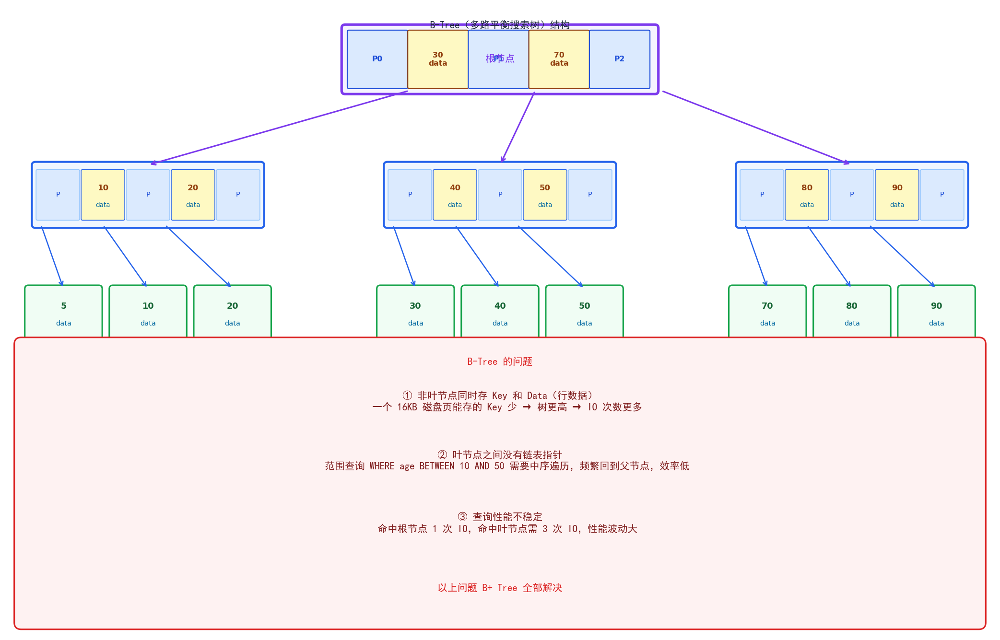
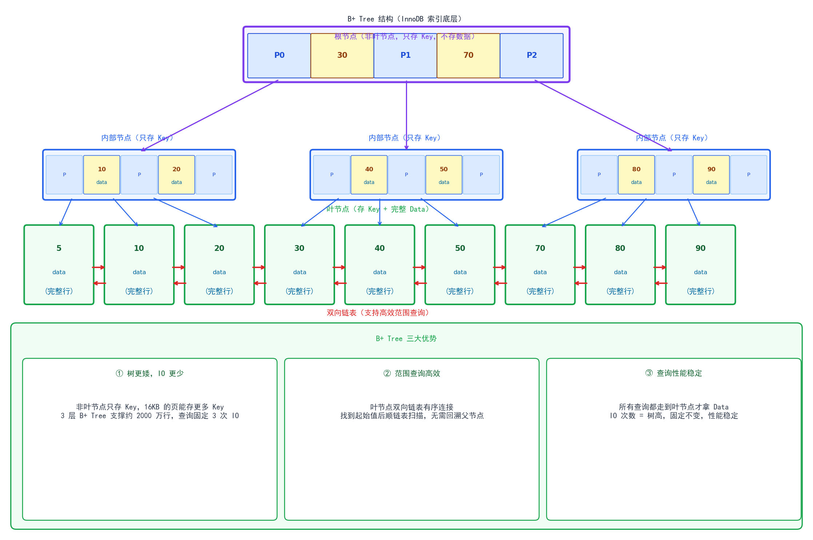
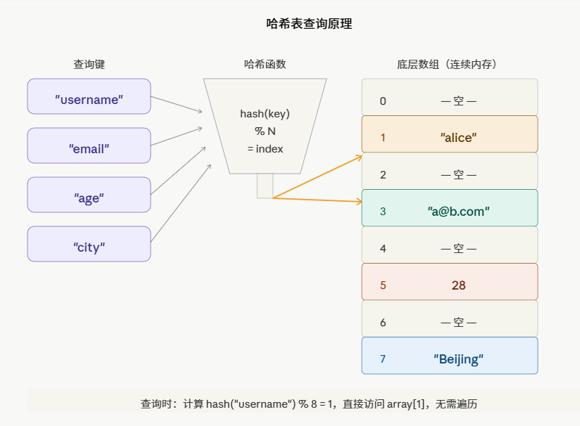

一、索引底层数据结构

索引的核心目标：利用预排序的数据结构，降低查询的时间复杂度，因为数据是存储在磁盘上的，磁盘的I/O访问是毫秒级的，减少磁盘的I/O次数，是索引选项的第一优先级。

1. B+ Tree 原理（为什么不用 B-Tree / 红黑树 / Hash）
   - Hash:Hash是进行等值查询的，致命缺陷，不支持范围查询，比如>、<、BETWEEN,实际业务对范围查询、排序需求高频。
   - 红黑树：虽然支持有序、范围查询，但数据量大时，树高，且每层做一次磁盘IO，很耗时。
   - B-Tree(多路平衡搜索树)：叶子节点之间没有指针连接，在范围查询时，不断回溯父节点进行中序遍历，产生多次随机IO。
     - 如图所示：
     
3. B+ Tree 结构特点（叶节点链表、非叶节点只存Key）
   关键操作
   - 叶子页满了向上推键：当一个叶子节点的键数超过 3，就从中间拆成两个叶子，把中间那个键的副本推给父节点作为分隔键。注意叶子节点的键是复制上去的，原叶子里还保留着。
   - 内部节点满了继续分裂：父节点收到推上来的键后，自己如果也满了，同样分裂——但内部节点的中间键是"移走"而不是复制，它只留在上层。
   - 根节点分裂是树长高的唯一方式：当分裂一路推到根节点，根也满了，就产生一个新的根，树高从这一刻 +1。整个演示里你能看到树从 1 层变成 2 层、再变成 3 层的过程。
   - 如图所示：

4. Hash 索引（Memory引擎，范围查询失效）
   - 原理如图所示：



二、InnoDB 索引分类
1. 聚簇索引（主键索引）：叶节点存整行数据
   InnoDB 中，主键索引就是聚簇索引。它的特点是：
    -  叶节点存的不是指针，而是完整的行数据。
      ```Text
         [id=1 | name=张三 | age=25 | ...]  ←── 完整一行数据
         [id=2 | name=李四 | age=30 | ...]
         [id=3 | name=王五 | age=22 | ...]
      ```
   - 核心特点：
      - 数据和索引存在一起，找到索引就找到数据，一次 IO 拿到整行
      - 每张表只能有一个聚簇索引
      -  InnoDB 强制要有主键；没有主键时，会选第一个非空唯一索引；再没有，InnoDB 内部自动生成一个 6 字节的 row_id

   3. 二级索引（辅助索引）：叶节点存主键值  
      - 除主键之外建的索引，都是二级索引（普通索引、唯一索引、联合索引都属于此类）。
      - 叶节点存的是：索引列的值 + 主键值，不存完整行数据。
      ```text
      [name=李四 | id=2]   ←── 只存索引列 + 主键
      [name=王五 | id=3]
      [name=张三 | id=1]
      ```
4. 回表查询
    - 二级索引查询时，叶节点只有主键值，拿到主键后还要去聚簇索引再查一次，这个过程叫回表。
    
    - 例如： SELECT * FROM user WHERE name = '张三';
       - ① 走 name 的二级索引 → 找到 name='张三' → 拿到 id=1
       - ② 拿 id=1 去聚簇索引再查一次 → 拿到完整行数据
       - 这两次查询合起来 = 回表 ，回表的代价：多一次 B+ Tree 查询，性能比聚簇索引差。

5. 覆盖索引（避免回表）
   - 如果查询的所有列，在二级索引的叶节点里都能找到（索引列 + 主键），就不需要回表，这叫覆盖索引。
   - 例如： -- 建了联合索引 (name, age)，SELECT id, name, age FROM user WHERE name = '张三';
        - 二级索引叶节点：[name='张三' | age=25 | id=1]
        - 查询需要的列：id、name、age  ── 全在叶节点里 ，不需要回表。

6. 聚簇索引和二级索引的区别
 
|        | 聚簇索引   | 二级索引           |
|--------|--------|----------------|
| 叶节点存什么 | 完整行数据  | 索引列 + 主键值      |
| 每表几个   | 只能 1 个 | 可多个            |
| 查询是否回表 | 不需要    | 需要（覆盖索引除外）     |
| 典型代表   | 主键索引   | 普通索引、唯一索引、联合索引 |


7. 联合索引 
  - 联合索引：对多个列一起建的索引，叫联合索引（复合索引）。
  - 添加方法：ALTER TABLE user ADD INDEX idx_name_age_city (name, age, city);
  - 排序规则： B+ Tree 的排序规则：先按 name 排，name 相同再按 age 排，age 相同再按 city 排。
  - 叶子节点排列
   ```text
     叶节点排列示意：
     [name=李四, age=22, city=北京 | id=3]
     [name=李四, age=25, city=上海 | id=7]
     [name=王五, age=30, city=广州 | id=2]
     [name=张三, age=20, city=北京 | id=1]
     [name=张三, age=20, city=深圳 | id=9]
     [name=张三, age=28, city=上海 | id=5]
   ```
8. 最左前缀原则
   - 联合索引能生效的前提：查询条件必须从索引的最左列开始，不能跳过中间列。
     -   以 (name, age, city) 为例：
      ```text
         -- 走索引
         WHERE name = '张三'                        -- ✓ 用到 name
         WHERE name = '张三' AND age = 20           -- ✓ 用到 name, age
         WHERE name = '张三' AND age = 20 AND city = '北京'  -- ✓ 全部用到
   
         -- 不走索引 or 部分走
         WHERE age = 20                             -- ✗ 跳过了 name，索引失效
         WHERE city = '北京'                        -- ✗ 跳过了 name、age，索引失效
         WHERE name = '张三' AND city = '北京'      -- ✓ name 走索引，city 不走（跳过了 age）
     ```
   - 范围查询截断： 范围查询（>、<、BETWEEN、LIKE 'xx%'）之后的列，索引失效。
     - 例如：WHERE name = '张三' AND age > 20 AND city = '北京'
     - 执行过程：
        - name = '张三' → 走索引，定位到 name=张三 的部分
        - age > 20 → 走索引范围扫描
        - city = '北京' → 索引失效，只能在扫出的行里逐行过滤

   - order by 也遵循最左前缀
     - 例如：
        ```text
          -- 走索引排序（Using index，无 filesort）
            ORDER BY name
            ORDER BY name, age
            ORDER BY name, age, city

          -- 触发 filesort（慢）
            ORDER BY age                -- 跳过 name
            ORDER BY name, city         -- 跳过 age
            ORDER BY age, name          -- 顺序与索引列顺序不一致
        ```

**Q：WHERE a=1 AND b=2 AND c=3，索引 (a,b,c) 和写成 WHERE c=3 AND b=2 AND a=1 效果一样吗？**
> 答：一样。MySQL 优化器会自动调整 WHERE 条件的顺序，与你写的顺序无关，只看索引定义的列顺序。

**Q：如何利用覆盖索引优化查询？**
> 答：把查询中 SELECT 的列和 WHERE 的列，都包含在联合索引里，让查询只走索引不回表。比如高频查询 SELECT id, name, age WHERE name=?，建 (name, age) 联合索引，id 是主键本身就在叶节点，三列全覆盖，不回表。

**Q：为什么 InnoDB 建议用自增整数做主键？**
> 答：两个原因。
> - 1. 性能：自增主键插入时，叶节点永远追加到最右边，；UUID 是随机值，插入位置随机，自增主键也会分裂，但只在末尾分裂，且 InnoDB 有顺序分裂优化，页利用率高、碎片少；UUID 导致全树随机分裂，空间浪费、IO 增加。
> - 2. 空间：主键值会被所有二级索引引用（叶节点存主键值），主键越小，二级索引占用空间越小。
   

三、索引失效场景（面试高频）
1. 不符合最左前缀：跳过最左列或中间列，索引失效。
2. 对索引列做函数/运算/类型转换
   - 索引列做函数： -- 失效：对索引列 create_time 做了函数 ，WHERE YEAR(create_time) = 2024。
   - 对索引列做运算： -- 失效 WHERE age + 1 = 18
   - 隐式类型转换： -- phone 字段是 VARCHAR，却传了数字， WHERE phone = 13800138000   -- 失效！MySQL 会对字符串列做隐式 CAST(phone AS signed)，等价于对索引列做了函数，索引失效。反过来不失效。

3. like '%xxx': -- 失效：左边有 % ,WHERE name LIKE '%张',-- 走索引：只有右模糊.
4. or 条件
   - 有效：-- 两个列都有索引才走，WHERE name = '张三' OR city = '北京'  -- 走索引（index merge）。
   - 无效：-- name 有索引，age 没索引， WHERE name = '张三' OR age = 20   -- 失效，有一个条件没有索引，MySQL 认为还是要全表扫，干脆放弃所有索引。

5. != / not in
   - WHERE status != 1
   - WHERE id NOT IN (1, 2, 3)
   - 大多数情况下索引失效，MySQL 认为不等于要扫大量数据，走全表更划算。

   注意：不是绝对失效，如果表数据量很小，或者 NOT IN 排除的很少，优化器可能仍选索引。最终看 explain。

6. IS NULL / IS NOT NULL
  - WHERE name IS NULL      -- 视情况，可能走也可能不走
  -  WHERE name IS NOT NULL  -- 多数情况失效
  - 取决于 NULL 值的比例，优化器自己判断。建议字段加 NOT NULL DEFAULT '' 约束，避免 NULL。

7.  -- status 只有 0/1，99% 的数据 status=1
   - WHERE status = 1   -- 索引失效！优化器选择全表扫
   - WHERE status = 0   -- 可能走索引（数据少）
   - 优化器会估算走索引的代价，如果走索引回表的行数超过全表的 30% 左右，会直接放弃索引走全表扫描。这是优化器的主动行为.

**Q：建了索引但查询还是很慢，可能是什么原因？**

>答：
> 1. 索引失效（上面 8 种场景）
> 2. 走了索引但回表次数太多（覆盖索引可优化）
> 3. 索引区分度太低，优化器放弃索引走全表
> 4. 表数据量小，全表扫比走索引更快，优化器主动选全表


四、索引设计原则
1. 区分度高的列: 区分度 = 列中不重复值的数量 / 总行数，值越接近 1 越好。
  - -- 查看区分度 SELECT COUNT(DISTINCT name) / COUNT(*) FROM user;
  - gender（男/女）  区分度 ≈ 0.00001  ← 建索引意义不大
  - name            区分度 ≈ 0.9      ← 适合建索引
  - phone           区分度 = 1        ← 非常适合
  - 区分度低的列建索引，优化器大概率放弃，走全表扫。

2. 频繁查询/排序/分组列：频繁出现在 WHERE / ORDER BY / GROUP BY 的列

3. 联合索引列顺序：区分度高的放左边
    例如： 
   - -- 正确：name 区分度高，放左边 INDEX (name, age, city)
   - -- 错误：gender 区分度极低，放左边毫无意义，INDEX (gender, name, age)
   - 同时遵循最常用的查询条件放最左边，让更多查询命中最左前缀。
4. 覆盖索引优先：设计联合索引时，把 SELECT 常用列也加进去，避免回表。
5. 控制索引数量
   
   索引不是越多越好，每多一个索引：
   - 写入变慢：INSERT / UPDATE / DELETE 都要同步维护索引 B+ Tree
   - 占用空间：每个索引都是一棵独立的 B+ Tree
   - 优化器负担：索引多了，优化器选择成本也高
  单表索引不超过 5 个，联合索引优先于多个单列索引。


6. 前缀索引（针对长字符串）

   对很长的字符串列（VARCHAR(255)、TEXT）建索引，会让索引很大。可以只取前 N 个字符建索引。

   选择前缀长度：区分度达到 90% 以上即可。
   ```text
     -- 逐步测试，找到区分度合适的长度
     SELECT COUNT(DISTINCT LEFT(email, 5))  / COUNT(*) FROM user;  -- 0.85
     SELECT COUNT(DISTINCT LEFT(email, 8))  / COUNT(*) FROM user;  -- 0.92
     SELECT COUNT(DISTINCT LEFT(email, 10)) / COUNT(*) FROM user;  -- 0.95
     -- 取 10 即可
   ```
7.  避免在索引列上做更新

设计原则总结
           
| 原则      | 说明                                 | 
|---------|------------------------------------|
| 区分度高    | 不重复值多的列才值得建                        |
| 查询驱动    | WHERE / ORDER BY / GROUP BY 频繁用到的列 |
| 联合优先    | 一个联合索引替代多个单列索引                     |
| 覆盖优先    | SELECT 的列也纳入索引，减少回表                |
| 数量控制    | 单表不超过 5 个，写多读少的表更要克制               |
| 前缀索引    | 长字符串取前缀，但失去覆盖索引能力                  |
| 避免频繁更新列 | 维护代价高                              |
