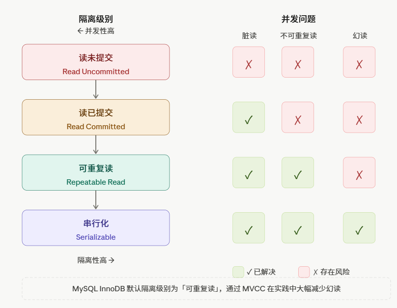

一、事务四大特性 ACID
### 1. Atomicity  原子性  —— undo log(回滚日志) 实现
   1. 原子性：一个事务内的所有操作，要么全部成功，要么全部回滚，不存在中间状态

   2. ep:
      ```mysql
       BEGIN;
        UPDATE account SET balance = balance - 500 WHERE id = 1;  -- 扣款
        UPDATE account SET balance = balance + 500 WHERE id = 2;  -- 收款
       COMMIT;
      ```
   3. 实现机制：undo log:
       - 每次修改数据前，InnoDB 先把原始值写入undo log;
       - 事务回滚时，按 undo log逆向恢复数据。

### 2. Consistency 一致性 —— 由其他三个特性共同保证
   1. 一致性：事务执行前后，数据库必须从一个合法状态转变到另一个合法状态，所有数据必须满足业务定义的约束规则
   2. 核心含义：一致性不是数据库自己保证，而是应用层逻辑+数据库约束公同维护。
   3. 一致性是目的，原子性、隔离性、持久性是手段，三者共同保证一致性。 

### 3. Isolation  隔离性  —— 锁 + MVCC 实现
   隔离性： 多个事务并发执行时，每个事务的操作对其他失误是隔离的，互不干扰，就好像事务是串行执行的一样。

### 4. Durability 持久性  —— redo log 实现
   持久性：事务一旦提交，数据永久保存，即使数据库宕机也不会丢失
   实现机制：redo Log

二、事务隔离级别
1. 四个级别：读未提交 / 读已提交 / 可重复读 / 串行化
   - 读未提交（READ UNCOMMITTED）：最低级别，一个事务可以读到其他事务尚未提交的数据。
   - 读已提交( READ COMMITTED)：只能读到其他事务已提交的数据。
   - 可重复读(REPEATABLE READ)：同一事务内，多次读同一行数据结果保持一致。
   - 串行化(SERIALIZABLE)：最高级别，所有事务完全串行执行，彻底消除脏读、不可重复读、幻读。代价是并发性能最差，容易产生大量锁等待甚至死锁。
   - 如图所示：
  
2. 各级别能解决的问题对比
   - 脏读（Dirty Read）:读到另一个事务未提交的数据
     - ep:
       1. 事务A: BEGIN; UPDATE balance =500; ROLLBACK;// 回滚
       2. 事务B: BEGIN; SELECT balance // 读到500，A未提交。拿着500去处理业务。

   - 不可重复读（Non-Repeatable Read）
     - ep:
       1. 事务A: BEGIN; SELECT balance; // ->1000 SELECT balance // ->500 同一个事物读到2次结果不一样。
       2. 事务B: BEGIN; UPDATE balance=500; COMMIT;

   - 幻读（Phantom Read）
     - ep：
       1. 事务A: BEGIN; SELECT COUNT(*) //->10 SELECT COUNT(*) //->11  多出来一行，像“幻觉一样”。
       2. 事务B: BEGIN; INSERT INTO user ; COMMIT;
   - 说明：不可重复度针对的是同一个行被修改，幻读主要是针对行数变化。
   
3. MySQL 默认级别是 RR（可重复读），原因是什么
   MySQL 默认可重复读，本质是为了配合早期 statement 格式 binlog 的主从复制安全性。


三、MVCC 原理（重点）
1. 两个隐藏列：trx_id / roll_pointer
    - trx_id: 最后一次修改这行数据的事务ID
    - roll_pointer: 指向undo log中上一个版本的指针。
   
2. undo log 版本链
   - 概念：每次修改一行数据，InnoDB不会直接覆盖，而是把旧版本写入undo log，通过roll_pointer串成一条链。    
   - ep:
      - 事务100：INSERT user(id=1，name='张三');
      - 事务200：UPDATE name='李四';
      - 事务300：UPDATE name ='王五';
      - 版本链如下：
        ```text
          [name='王五' | trx_id=300 | roll_pointer] ─┐
                                              ↓
                           [name='李四' | trx_id=200 | roll_pointer] ─┐
                                                                       ↓
                                            [name='张三' | trx_id=100 | roll_pointer=null]  
          
           链头是最新版本，链尾是最初版本。MVCC 就是通过这条链，找到对当前事务"可见"的那个版本。
         ```
     - 版本链的数据本质上存在 undo log 里，不是在数据页里另外存一份。数据页里只有最新版本（链头），每个版本通过行记录头里的 roll_pointer 指针串联起来，指向 undo log 里的上一个版本。 

3. ReadView 结构
 - m_ids（活跃事务列表）
 - min_trx_id（最小活跃事务ID）
 - max_trx_id（下一个待分配事务ID）
 - creator_trx_id（创建该 ReadView 的事务ID）
 - ReadView 是事务在某一个时刻拍的一张“快照名单”。记录了当时系统里那些事务还活着（未提交），用来判断版本链上的哪一个版本是当前事务可见的。

4. 可见性判断规则（核心算法）
   
    拿版本链上每个版本的 trx_id，对照 ReadView 判断是否可见： 版本的 trx_id = V
     1. ① V == creator_trx_id         → 自己改的，可见 ✓
     2. ② V < min_trx_id              → 该版本在 ReadView 生成前已提交，可见 ✓
     3. ③ V >= max_trx_id             → 该版本在 ReadView 生成后才开启，不可见 ✗
     4. ④ min_trx_id <= V < max_trx_id：
           1. V 在 m_ids 中            → 该事务还未提交，不可见 ✗
           2. V 不在 m_ids 中          → 该事务已提交，可见 ✓
     5. 从版本链链头往下找，找到第一个"可见"的版本，就是本次 SELECT 的结果。


5. RC 与 RR 下 ReadView 生成时机的区别
- RC（读已提交）：每次 SELECT 生成新 ReadView
   - 能读到其他事务最新提交数据
   - 同一个事务两次读可能结果不通 - > 不可重复读
- RR（可重复读）：只在第一次 SELECT 生成，后续复用
   - 整个事务期间看到的数据快照固定不变。
   - 同一个事务两次读结果一定相同 -> 解决不可重复度。

四、MVCC 如何解决幻读（RR级别） 
 快照读 vs 当前读

| 语句类型 | 普通 SELECT | SELECT FOR UPDATE / LOCK IN SHARE MODE / UPDATE / DELETE / INSERT |
| :--- | :--- | :--- |
| **读的数据** | undo log 版本链中的历史快照 | 最新的已提交数据 |
| **加锁情况** | 不加锁 | 加锁 |
| **幻读解决方式** | MVCC（ReadView） | Gap Lock |

2. MVCC 解决快照读幻读
   - ep: 假设存在表存在2条初始化数据，由早起的事务trx_id=5插入并提交：
     - id=1， amount=100;id=2 amount=200;
     - 产生2事务A：trx_id=10,负责读数据，事务B:trx_id=20 ,负责插入数据，同时进行。
     - 时间轴如下：
       ```text
           时间    事务A（trx_id=10）              事务B（trx_id=20）
            T1      BEGIN
            T2      SELECT * FROM orders
                    → 创建 ReadView
                      m_ids=[10,20]
                      min_trx_id=10
                      max_trx_id=21
                    → 读到 id=1、id=2，共2条

           T3                                      BEGIN
           T4                                      INSERT id=3, amount=300
           T5                                      COMMIT

           T6      SELECT * FROM orders
                   → 复用T2的ReadView（RR级别）

       ```
     - T6判断过程：此时表中存在3条数据，各自版本链如下：
          1. id=1 trx_id = 5(原始数据)
          2. id=2 trx_id = 5(原始数据)
          3. id=3 trx_id= 20(事务新插入)
     - T6判断任然用的是第一次创建的ReadView,对每行数据进行ReadView判断可行性
          1. id=1 ,5<min_trx_id(10): ReadView之前已经提交，数据可见。
          2. id=2 ,5<min_trx_id(10): ReadView之前已经提交，数据可见。
          3. id=3 ,min_trx_id(10)<20<max_trx_id(21)，落在中间范围，在min_ids[10,20]事务B未提交，不可见。
     - T6事务A仍然只读到id=1和id=2的数据。幻读没有发生。
     - 总结：MVCC 解决快照读幻读的本质是：可重复读级别下 ReadView 只在事务第一次 SELECT 时创建，之后一直复用。后来插入的新行，其 trx_id 在 m_ids 名单里，永远判定为不可见，所以事务全程看到的行数保持一致，幻读不会发生。

3. Gap Lock 解决当前读幻读
    - 当前读：当前读的语义是"我要操作最新数据"，所以不能用历史快照，ReadView 在这里完全失效。其他事务新插入并提交的行，当前读必然能看到，幻读就此产生。
    - 核心： 间隙是根据索引上已有的值来划分的，没有索引就没有间隙锁。
    - ep: 
       - 存在id列。且id是住建索引，id: 1,5,10;
       - 索引是存在3个值，则数轴分成5个区间
       - （-∞，1）,1,（1,5）,5,（5,10）,10,(10,∞);
       - 事务A执行查询： select * from t where id<8 for update;
       - 满足条件的行时id=1,id=5,InnoDB加锁范围：
          1. 行锁：id=1,id=5
          2. 间隙锁：（-∞,1）,(1,5),(5,10);
       - 在间隙锁区间的值无法正常插入。 

4. RR 级别下幻读未被完全解决的场景
   - 说明： 快照读和当前读混用，当前读触碰了原本不可见的行，让那行产生了属于自己事务的新版本。
   
五、三大日志
### 1. undo log —— 回滚 + MVCC 版本链
  - 作用： 事务回滚+MVCC版本链
  - 解释： 每次修改数据之前，InnoDB 先把旧值写进 undo log，相当于"存档"。如果事务最终回滚，就用 undo log 把数据还原回去。同时 MVCC 的版本链就是串联在 undo log 上的，其他事务读历史版本时，顺着版本链去 undo log 里取。

### 2. redo log —— WAL 机制，崩溃恢复（循环写）
  - 作用：崩溃修复，保证已提交的事务不丢失
  - 解释：核心机制叫 WAL（Write-Ahead Logging，先写日志再写数据）。MySQL 修改数据时，不会立刻把数据页写回磁盘（随机写，太慢），而是先顺序写 redo log，再在内存（Buffer Pool）里改数据页，之后由后台线程把脏页慢慢刷到磁盘。
  
### 3. binlog  —— 主从复制 + 数据恢复（追加写）
  - 作用：主从复制 + 数据恢复到任意时间点。
  - 解释：binlog 是 MySQL Server 层的日志，跟存储引擎无关，记录的是逻辑操作（执行了什么 SQL 或哪些行发生了变化）。追加写入，不会覆盖，可以保留很长时间。
  - 三种格式:
     1. statement  → 记录 SQL 语句本身（有主从不一致风险）
     2. row        → 记录每行数据的实际变化（安全，主流选择）
     3. mixed      → 自动判断用哪种

  总结：
  - undo log  → 后悔药，改错了能撤销，顺便支撑 MVCC
  - redo log  → 安全网，崩溃了能恢复，保证提交不丢
  - binlog    → 流水账，记录所有变更，支撑复制和归档

### 4. redo log vs binlog 区别
| 对比维度 | redo log | binlog |
|---|---|---|
| 归属层 | InnoDB 存储引擎层 | MySQL Server 层 |
| 记录内容 | 物理日志（某页某偏移改了什么值） | 逻辑日志（执行了什么 SQL / 哪行数据如何变化） |
| 写入方式 | 循环写，固定大小，写满覆盖旧内容 | 追加写，不限大小，永久保留 |
| 用途 | 崩溃恢复（crash-safe） | 主从复制、数据归档、时间点恢复 |
| 生命周期 | 短，checkpoint 后可覆盖 | 长，可保留数天/数月 |
| 写入时机 | 事务执行过程中持续写入 | 事务提交时一次性写入 |

**核心区别一句话**：redo log 是 InnoDB 为了崩溃恢复造的"安全网"，循环使用、不能用于复制；binlog 是 Server 层为了复制和归档造的"流水账"，追加写入、不能用于崩溃恢复。两者缺一不可。

### 5. 两阶段提交（2PC）保证 redo log 与 binlog 一致


