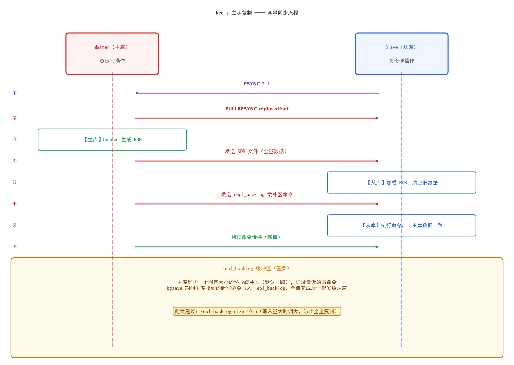
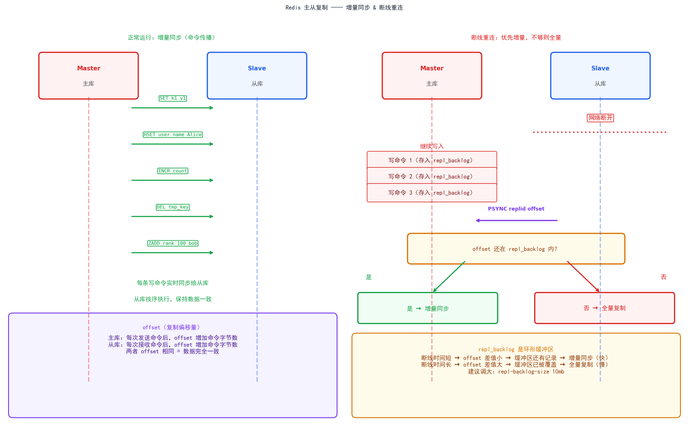

一、Redis 基础数据结构

 Redis 每种数据结构在数量小和大时，用的底层不同，目的是为了节省内存。

### 1. String（字符串）
- 底层：SDS（简单动态字符串），没有直接使用C的字符串，而是自己实现的SDS
  ```text
     struct SDS {
      int len;      // 已使用长度
      int free;     // 剩余空间
      char buf[];   // 实际数据
     }
  ```
  
- 相对于C字符串的优势：
  1. o(1)获取长度（直接读len，不用遍历）
  2. 预分配空间，追加操作不频繁扩容
  3. 二级制安全（可以存储图片、序列化数据等包含\0的内容）
  

- 常用命令：SET/GET/INCR/EXPIRE
  1. INCR page_view // page_view 这个 key 的值加 1
  2. INCRBY page_view 10 // 加 10
  3. SET token "abc" EX 3600 // 设置key并设置过期时间3600秒
  4.  EXPIRE name 60  // 给name这个key设置60秒的过期时间
  5. SETNX lock_key "1" // 不存在才设置  

- 使用场景：缓存、计数器、分布式锁
  1. 缓存：
     > SET user:1001 '{"id":1001,"name":"Alice","age":25}' EX 60
  
  2. 计数器：
     > INCR article:8888:views          # 每次访问 +1
     
     > GET article:8888:views           # "10283"    
  
  3. 限流
  4. 分布式锁
  5. Session 存储

### 2. Hash（哈希）
- 底层：ziplist / hashtable
  - 紧凑列表：需要满足2个条件使用：
    1. 字段数量<=128
    2. 每个字段的键或者值长度<=64字节
  - hashtable: 任一条件超出阈值自动转换，一旦转换hashtable,不会退回。

- 常用命令：HSET/HGET/HMSET/HGETALL
  - HSET: HSET user:1 name “张三” age 25 city "北京"
  - HGET: HGET user:1 name  # 张三
  - HMGET: HMGET user:1 name city  #获取指定字段  
  - HGETALL:HGETALL user:1 #获取所有字段
  - HDEL: HDEL user:1 name #删除name字段
  - HEXISTS: HEXISTS user:1 name # 判断字段是否存在

- 使用场景：用户信息、购物车
   - 用户信息 （比String 存JSON更灵活，可单独修改某一个字段，不用每次反序列化）
   

### 3. List（列表）
- 底层：ziplist / quicklist
  - ziplist: 需要满足2个条件使用：
     1. 元素数量<=128
     2. 每个元素长度<=64字节
  - quicklist： 超出阈值后转换。quicklist 是一个双向链表，每个节点是一个 ziplist

- 常用命令：LPUSH/RPUSH/LRANGE/BLPOP
  - 入队/出队
    - LPUSH: LPUSH list a b c # 从左插入，结果： c  b  a
    - RPUSH: RPUSH list x y z # 从右插入，结果：c b a x y z
    - LPOP: LPOP list # 从左弹出 ,返回 c
    - RPOP： RPOP list  # 从右弹出 ，返回 z
    - LPOP: LPOP list 3  # 一次性弹3个
  

  - 查看/ 截取：
    - LRANGE:LRANGE list 0 -1        # 查看全部元素
    - LRANGE list 0 4         # 查看前 5 个
    - LLEN list               # 列表长度
    - LINDEX list 2           # 查看下标为 2 的元素，O(N)
    - LTRIM list 0 99         # 只保留前 100 个，其余删除
  
  - 阻塞 
    - BLPOP list 10 # 阻塞弹出，最多等 10 秒，没有数据就阻塞
    - BRPOP list 10           # 同上，从右弹出

- 使用场景：消息队列、最新列表
   

4. Set（集合）
- 底层：intset / hashtable
  - 元素全是整数且数量 ≤ 512 时，使用 intset 编码——一个有序的整数数组
  - 超出阈值后转换hashtable

- 常用命令：SADD/SMEMBERS/SINTER/SUNION
  - 增删查
    1. SADD tags "redis" "nosql" "cache"   # 添加元素，返回成功个数
    2. SREM tags "cache"                   # 删除元素
    3. SISMEMBER tags "redis"              # 判断是否存在，1/0
    4. SMISMEMBER tags "redis" "mysql"     # 批量判断（Redis 6.2+）
    5. SMEMBERS tags                       # 获取所有元素（无序）
    6. SCARD tags                          # 元素数量
    7. SRANDMEMBER tags 3                  # 随机返回 3 个，不删除
    8. SPOP tags 2                         # 随机弹出 2 个并删除
  - 集合运算
    1. SUNION s1 s2          # 并集
    2. SINTER s1 s2          # 交集
    3. SDIFF s1 s2           # 差集（s1 有，s2 没有）
    4. SUNIONSTORE dest s1 s2   # 并集结果存入 dest
    5. SINTERSTORE dest s1 s2   # 交集结果存入 dest
    6. SDIFFSTORE dest s1 s2    # 差集结果存入 dest

- 使用场景：标签、共同好友、去重


5. ZSet（有序集合）
- 底层编码：ziplist / skiplist + hashtable，每个元素关联一个 score（分数），按 score 自动排序。
  - 元素数 ≤ 128 且单个元素 ≤ 64 字节 → ziplist
  - 超过阈值 → skiplist（跳表）+ hashtable

- 常用命令：ZADD/ZRANGE/ZRANK/ZRANGEBYSCORE
  - 增删查
    1. ZADD rank 100 "Alice" 200 "Bob" 150 "Carol"  # 添加，score 越小排名越靠前
    2. ZREM rank "Alice"                             # 删除
    3. ZSCORE rank "Bob"                             # 查询某成员的 score
    4. ZCARD rank                                    # 元素总数
    5. ZINCRBY rank 50 "Alice"                       # score 自增 50
  - 排名查询
    1. ZRANK rank "Alice"          # 正序排名（score 从小到大），从 0 开始
    2. ZREVRANK rank "Alice"       # 倒序排名（score 从大到小）
  - 范围查询
    1. ZRANGE rank 0 -1                    # 正序返回所有，score 从小到大
    2. ZRANGE rank 0 -1 WITHSCORES        # 同上，带 score
    3. ZREVRANGE rank 0 2                  # 倒序返回前 3 名
    4. ZRANGEBYSCORE rank 100 200          # 返回 score 在 100~200 之间的成员
    5. ZRANGEBYSCORE rank -inf +inf        # 返回所有
    6. ZRANGEBYSCORE rank 100 200 LIMIT 0 10  # 分页
    7. ZCOUNT rank 100 200                 # score 在 100~200 之间的成员数量
  - 集合运算
   1. ZUNIONSTORE dest 2 z1 z2      # 并集，score 默认相加
   2.  ZINTERSTORE dest 2 z1 z2      # 交集，score 默认相加
  
- 使用场景：排行榜、延迟队列

二、Redis 高级数据结构
1. Bitmap   —— 签到、用户活跃统计
2. HyperLogLog —— UV 统计（近似计数）s
3. Geo      —— 附近的人、地理位置
4. Stream   —— 消息队列（Redis 5.0+）


三、Redis 持久化
1. RDB（快照）：Redis Database Snapshot ,把某一时刻内存的全量数据，以二进制快照的形式写入到磁盘（.rdb文件）
- 触发方式：save / bgsave / 自动触发
     1. save(同步，阻塞):主线程执行，期间Redis完全阻塞，不响应任何请求。
     2. bgsave(异步，阻塞)：主线程 fork 子线程，子线程负责写RDB，主线程继续服务。
     3. 自动触发（配置文件）：
        ```text 
           # redis.conf 
           save 900 1  # 900秒内有1次写操作，触发bgsave
           save 300 10  # 300秒内有10次写操作
           save 60 10000  # 60秒内有10000次写操作
           
           # 满足任意一个条件出发bgsave
        ```
- 优缺点

|     |                              |
|-----|------------------------------|
| 优点  | 文件紧凑（二进制压缩），体积小；恢复速度快，直接加载内存 |
| 优点  | 对主线程影响小（bgsave 异步）           |
| 缺点  | 可能丢数据：两次快照之间宕机，这段时间的写入全丢     |
| 缺点  | fork 子进程有瞬间开销，内存大时 fork 本身耗时 |


2. AOF（追加日志）：AOF 通过记录每一条写命令来实现持久化，重启时重放命令恢复数据。
- 三种刷盘策略：always / everysec / no
  1. always： 每次写命令都立即调用 fsync 刷盘，性能最慢，几乎不丢数据。
  2. everysec（默认）：每秒由后台线程执行一次 fsync，性能较好，最多丢失 1 秒数据。
  3. no：不主动 fsync，由操作系统决定何时刷盘（通常 30s），性能最快，风险最高，可能丢失较多数据。
  
  - AOF 重写机制：
    - 原因：AOF 文件会随写命令不断增长，里面包含大量冗余指令（比如对同一个 key 反复 INCR），文件越大，恢复越慢。
    - 核心原理：
       1. 重写并不是"读旧 AOF 处理压缩"，而是 直接遍历当前内存中的数据集，为每个 key 生成能重建它的最少命令，写成一个新的 AOF 文件。
       2. 整个过程通过 fork 子进程完成（类似 RDB 的 bgsave），主进程不阻塞。
       3. 子进程构建新 AOF 文件期间，主进程的写命令会被记录到一个 AOF 重写缓冲区，重写完成后追加到新文件末尾，保证不丢数据。
       4. 新文件替换旧文件，完成"瘦身"。
    - 重写触发条件：
      ```text
         # redis.conf
         auto-aof-rewrite-percentage 100   # AOF 文件比上次重写后大 100% 时触发
         auto-aof-rewrite-min-size 64mb    # 且文件大于 64MB
      ```
3. RDB + AOF 混合持久化（Redis 4.0+）
   - 4.0+默认开启，aof-use-rdb-preamble yes
   - 执行 AOF 重写时，新 AOF 文件的前半部分是 RDB 格式的全量数据（二进制，紧凑）
   - 后半部分是重写过程中产生的增量命令（AOF 格式文本）
   - [RDB 格式的全量快照] + [AOF 格式的增量命令]   

4. 如何选择持久化方案
   -  不需要持久化（纯缓存，允许丢失）:关闭 RDB 和 AOF，性能最高
   -  允许丢几分钟数据，重启恢复要快:只开 RDB（bgsave）
   -  数据不能丢（金融、订单）: 只开 AOF（everysec）
   -  既要恢复快，又要少丢数据（推荐生产方案）: 开混合持久化


四、Redis 过期策略与内存淘汰
1. 过期键删除策略
- 惰性删除：不主动删除，等下次访问这个key 时，才检查是否过期，过期则删除并返回nil。
    1. 优点：对CPU友好，不主动消耗资源
    2. 缺点：如果过期key一直没有被访问，永远不会被删除，内存泄露。 
- 定期删除:Redis 每隔一段时间，从设置了过期时间的key中随机抽样一批，检查并删除其中已过期的。
    1. 默认每秒执行10次，随机抽取20个设置了TTL的key
    2. 删除其中过期的，如果过期比例>25%,立即再抽一轮。
    3. 每轮执行时间不能超过25ms,防止阻塞。
    4. 优点：能主动回收内存
    5. 缺点：随机抽样，不能保证所有过期key被及时清理。
  
2. 内存淘汰策略（8种）： 当Redis内存达到maxmemory 上限时，触发淘汰策略决定删谁。
- 配置方式：
  1. maxmemory 4gb  
  2. maxmemory-policy allkeys-lru  #淘汰策略

- noeviction / allkeys-lru / volatile-lru 等
  - 不淘汰：
     1. noeviction 不删除任何key，写入直接报错（默认值）
  - 针对所有key：
     1. allkeys-lru: 淘汰最近最少使用的key(推荐)
     2. allkeys-lfu: 淘汰访问频率最低的key
     3. allkeys-random: 随机淘汰
  - 针对设置了TTL的key(volatile=有过期时间的) ：
     1. volatile-lru: 从有过期时间的key中，淘汰最近最少使用的
     2. volatile-lfu: 从有过期时间的key中，淘汰访问频率最低的
     3. volatile-random: 从有过期时间的key中，随机淘汰
     4. volatile-ttl: 从有过期时间的key中，淘汰剩余ttl最小的。 
   - 如何选择：
     1.纯缓存场景（允许数据丢失）：allkeys-lru 或 allkeys-lfu(推荐)
     2.缓存+持久化数据混存（有些key不能删除）： volatile-lru(只淘汰设置了TTL的，没有TTL的key不删除。)
     
3. LRU 与 LFU 的区别
    LRU:最近最少使用，淘汰依据：最后一次访问时间  
    LFU:最不经常使用，淘汰依据：历史访问频率


五、Redis 高可用
1. 主从复制
  - 作用： 数据备份+读写分离，主库写，从库读
  - 建立连接阶段：
    1. 从节点（slave）执行 replicaof <master_ip> <master_port>（旧版叫 slaveof）
    2. 从节点保存主节点地址信息，主从之间建立 TCP 连接
    3. 从节点发送 PING 命令进行握手探测
    
  - 身份验证 & 基本信息同步：
    1. 如果主节点设置了 requirepass/masterauth，从节点发送 AUTH 完成鉴权
    2. 从节点发送 REPLCONF listening-port <port>，告知自己的端口
    3. 主节点记录该从节点信息，便于后续 INFO replication 查看


  - 全量同步：
    1. 从节点发送 PSYNC ? -1（? 表示不知道 runid，-1 表示没有偏移量）
    2. 主节点识别这是首次同步，回复 +FULLRESYNC <runid> <offset>
    3. 主节点执行 bgsave：fork 子进程生成 RDB 快照文件
    4. 在 RDB 生成期间，主节点会把新执行的写命令记录到一个**复制缓冲区（replication buffer）**中
    5. RDB 文件生成完毕后，通过 socket 直接发送给从节点（不写盘，新版本支持无盘传输 diskless replication）
    6. 从节点接收 RDB 文件：先清空自己当前的旧数据，加载 RDB 文件到内存,完成基础数据对齐
    7. 主节点将全量同步期间缓冲区中累积的写命令,发送给从节点重放,补齐数据
    
  - 增量同步：
    1. 主节点后续收到的每一条写命令，都会异步转发给所有从节点
    2. 从节点持续接收并重放这些命令，保持和主节点的数据一致
    3. 主从之间通过 REPLCONF ACK <offset> 机制定时（默认1秒）汇报偏移量,主节点借此判断从节点的延迟情况、是否存活
  
  - 心跳与断线重连  
    1. 主节点定期向从节点发送 PING，从节点定期发送 REPLCONF ACK，互相确认存活
    2. 如果网络抖动导致短暂断连，不会重新全量同步，而是尝试部分重同步（Partial Resync）
   
  - 三个核心概念 ：
    1. replication offset：主从都维护一个复制偏移量，记录已同步的字节数
    2. replication backlog：主节点维护的一个环形缓冲区（默认1MB），保存最近执行的写命令
    3. run id：标识主节点身份的唯一ID
  
  - 断线重连流程：
    1. 从节点发送 PSYNC <runid> <offset>，带上自己记得的主节点ID和偏移量
    2. 主节点检查 runid 匹配 且offset 仍在 backlog 缓冲区范围内
    3. 满足条件 → 回复 +CONTINUE，只把缺失的那一段命令发过去（部分重同步，开销很小）
    4. 不满足条件（比如断开太久,offset 已经被 backlog 覆盖冲掉了）→ 触发全量同步




六、 Redis 哨兵（Sentinel）模式详解

### 1. 作用
  哨兵是 Redis 官方提供的**高可用解决方案**，用来解决"主从复制下主节点单点故障"的问题。核心职责：

- **监控**：持续检测主、从节点是否健康存活
- **故障发现**：判断主节点是否真的下线（避免误判）
- **自动故障转移**：在主节点宕机后,自动从从节点中选出新主并完成切换
- **通知**：将最新的主节点地址告知客户端，实现故障对业务的透明化
  哨兵本身**不存储业务数据**，是独立部署的一组进程，生产环境建议**至少 3 个**，且为奇数个，便于投票判断。

---

### 2. 核心概念

| 概念 | 说明 |
|------|------|
| **Sentinel（哨兵）** | 独立运行的监控进程，不少于3个组成哨兵集群 |
| **Master / Slave** | 被监控的主从 Redis 节点 |
| **quorum** | 判定主节点"客观下线"所需的最少哨兵票数 |
| **SDOWN（主观下线）** | 单个哨兵认为某节点已下线（可能误判） |
| **ODOWN（客观下线）** | 达到 quorum 数量的哨兵共同确认节点下线（更可信） |
| **epoch（纪元）** | 每轮故障转移的版本号，类似 Raft 中的 term，用于选举防冲突 |
| **leader 哨兵** | 被选出来、实际执行本轮故障转移操作的那个哨兵 |
 
---

### 3. 监控机制

哨兵启动后持续做三件事：

1. **互相发现**：通过订阅主节点的 `__sentinel__:hello` 频道，哨兵之间互相感知，并获取主节点提供的从节点列表
2. **PING 心跳**：哨兵每隔默认 1 秒向主、从节点发送 `PING`，判断存活
3. **INFO 探测**：哨兵每隔默认 10 秒向主节点发送 `INFO`，获取从节点列表、角色信息等拓扑变化
---

### 4. 故障发现：主观下线 → 客观下线

### 主观下线（SDOWN）
单个哨兵在 `down-after-milliseconds`（默认30秒）内没收到主节点对 PING 的有效回复，**自己**先标记其"主观下线"。这只是个人判断，可能是网络抖动造成的误判。

### 客观下线（ODOWN）
该哨兵不会立刻行动，而是通过 `SENTINEL is-master-down-by-addr` 询问其他哨兵的看法。当**达到 quorum 数量**的哨兵都认为主节点下线，才正式确认为"客观下线"。

> 这套"先主观、再投票确认"的两阶段机制，本质上就是为了防止单点误判引发不必要的主从切换。
 
---

### 5. 领导者哨兵选举

客观下线确认后，需要选出**唯一一个**哨兵来执行故障转移，避免所有哨兵同时操作导致混乱。

选举基于**简化版 Raft 算法**：

1. 发现 ODOWN 的哨兵向其他哨兵发起"我要当 leader"的请求，并带上自己的 epoch
2. 其他哨兵在同一 epoch 内**先来先投**，每个哨兵只投一票
3. 某哨兵获得**超过半数**的票 → 成为本轮故障转移的 leader
---

### 6. 故障转移执行流程

leader 哨兵开始实际切换：

#### (1) 选出新主节点（按优先级）
```
① 过滤已下线 / 长时间无响应 / 与旧主断连过久的从节点
② 按 slave-priority 排序（数值小优先，0表示永不参选）
③ 优先级相同 → 比较复制偏移量 offset，数据越新越优先
④ 仍相同 → 比较 run id，字典序小的优先（兜底规则）
```

#### (2) 提升新主
向选中的从节点发送 `SLAVEOF NO ONE`，使其升级为主节点

#### (3) 切换其余从节点
向其余从节点发送 `REPLICAOF <新主IP> <新主端口>`，让它们改为复制新主（触发部分重同步或全量同步）

#### (4) 旧主节点降级
旧主节点恢复上线后，哨兵发现它已非真正主节点，将其降级为新主的从节点

#### (5) 通知客户端
哨兵更新自己内部记录的主节点信息，客户端通过查询哨兵获取最新地址
 
---

### 7. 客户端如何感知主节点切换

客户端**不直连 Redis 主节点地址**，而是连接哨兵集群：

1. 客户端向任意一个哨兵发送 `SENTINEL get-master-addr-by-name <master-name>`
2. 哨兵返回当前真正的主节点地址
3. 主从切换后,客户端再次查询哨兵即可获取最新地址（Jedis / Lettuce 等主流 SDK 已内置该逻辑）
---

### 8. 脑裂（Split-Brain）问题

#### 8.1 什么是脑裂

**脑裂**指因为**网络分区**，原主节点其实还在正常运行（只是和大部分哨兵/从节点失联），但哨兵集群因为收不到它的响应，误以为它下线了，于是选举出了一个**新主节点**。

此时集群中**同时存在两个"主节点"**：
- 旧主：仍在原网络分区里，可能继续接受客户端写入
- 新主：被哨兵提升,也在接受写入
#### 8.2 脑裂导致的数据丢失场景

```
时间线：
T1: 主节点 Master-A 正常运行，客户端持续写入
T2: 网络分区发生，哨兵与 Master-A 失联（但客户端某些节点仍能连到A）
T3: 哨兵判定 Master-A 下线 → 选举 Master-B 为新主
T4: 部分客户端仍在写 Master-A（网络分区另一侧）
T5: 网络恢复，Master-A 被哨兵降级为从节点，自动同步 Master-B 的数据
     → Master-A 在 T2~T5 期间收到的写入数据，全部被覆盖丢弃！
```

**核心问题**：旧主在脑裂期间继续接受的写入,在网络恢复、被强制降级为从节点并重新同步时,会被**直接覆盖丢弃**，造成数据丢失。

#### 8.3 如何缓解脑裂

Redis 本身无法彻底杜绝脑裂（CAP 中 AP/CP 的取舍问题），但可以通过配置**大幅降低**数据丢失的范围：

```conf
# 主节点必须至少有N个从节点连接，否则拒绝写入
min-replicas-to-write 1
 
# 从节点的延迟必须在 N 秒以内，才算"正常连接"
min-replicas-max-lag 10
```

**原理**：一旦网络分区发生，旧主节点因为联系不到足够数量、延迟够低的从节点，会**主动拒绝客户端的写请求**，从而把"脑裂期间可能丢失的数据窗口"压缩到最小（甚至趋近于0），而不是任由它继续无限制写入。

> 这是"牺牲一定可用性（拒绝写入），换取数据一致性"的典型权衡（CP 倾向）。

#### 8.4 更彻底的方案

如果业务对一致性要求极高，单纯靠哨兵+参数兜底并不够,可考虑：
- 使用 **Redis Cluster**，原生支持多分片 + 槲位级别的一致性判断
- 业务层引入**写入幂等 + 版本号校验**，配合重试与冲突检测
- 关键数据不完全依赖 Redis,用关系型数据库 / 强一致存储做兜底
---

### 9. 关键配置参数

| 参数 | 说明 |
|------|------|
| `down-after-milliseconds` | 主观下线判定时间，默认30000ms |
| `quorum` | 判定客观下线所需的最少哨兵票数 |
| `failover-timeout` | 故障转移超时时间，超时会重试 |
| `parallel-syncs` | 故障转移后允许同时向新主发起同步的从节点数 |
| `min-replicas-to-write` | 主节点写入所需的最少从节点连接数（脑裂缓解） |
| `min-replicas-max-lag` | 从节点被视为"正常"所允许的最大延迟秒数（脑裂缓解） |
 
---

###  10. 流程图总结

```
┌─────────────┐    PING超时未回    ┌──────────────┐
│  哨兵A监控   │ ─────────────────> │ 主观下线SDOWN │
└─────────────┘                    └──────┬───────┘
                                           │ 询问其他哨兵
                                           ▼
                                  ┌──────────────────┐
                                  │ 达到quorum票数确认  │
                                  │   客观下线 ODOWN    │
                                  └────────┬──────────┘
                                           │
                                           ▼
                                ┌────────────────────┐
                                │ Raft式选举 leader哨兵 │
                                └──────────┬──────────┘
                                           │
                                           ▼
                          ┌──────────────────────────────┐
                          │ 1. 挑选最优从节点              │
                          │ 2. SLAVEOF NO ONE → 升级新主   │
                          │ 3. 其他从节点 REPLICAOF 新主    │
                          │ 4. 旧主恢复后降级为从节点        │
                          └──────────────────────────────┘
 
⚠ 脑裂风险点：若旧主在T2~T5期间仍接受写入，
   降级同步新主时这部分数据会被覆盖丢失
   → 用 min-replicas-to-write / min-replicas-max-lag 兜底
```
